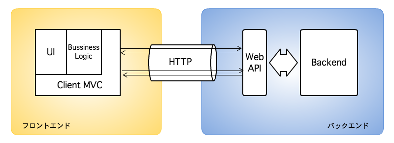
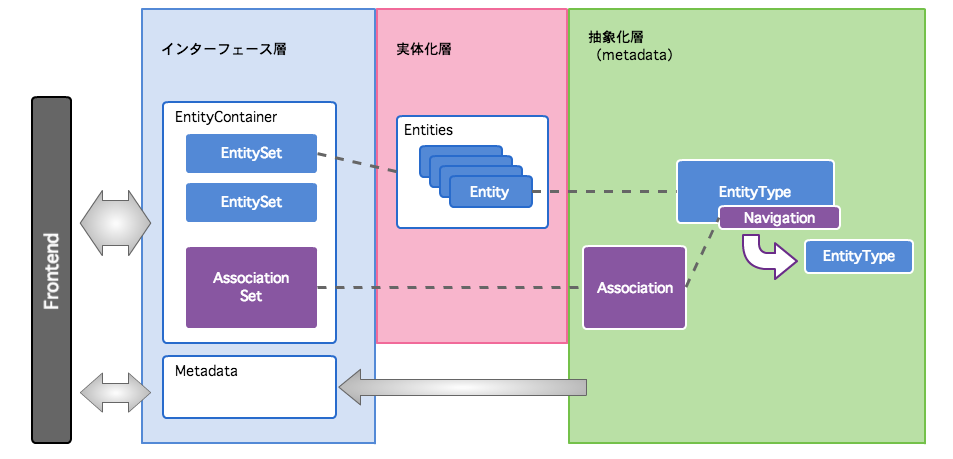
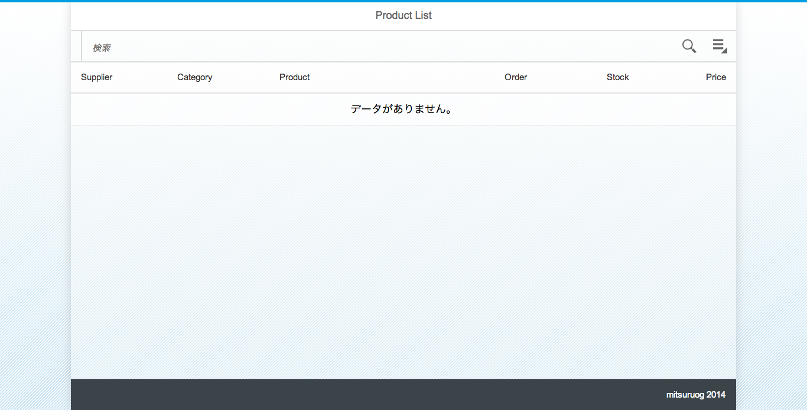
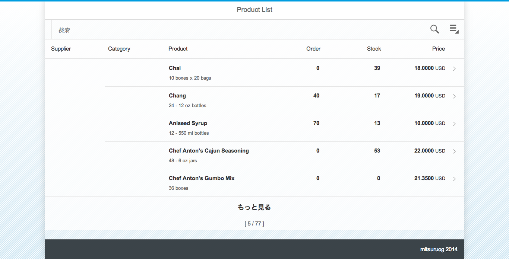
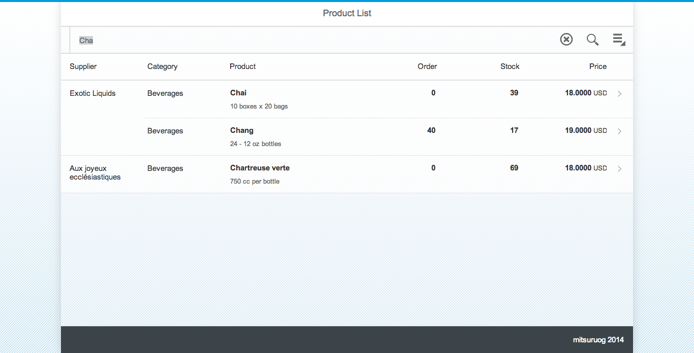
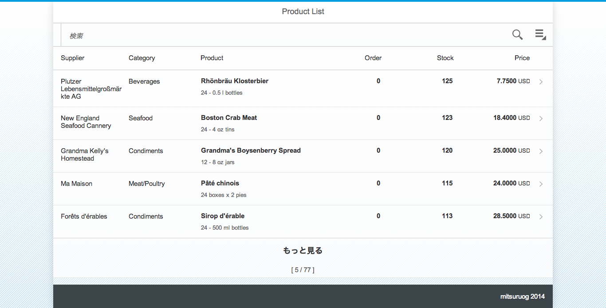
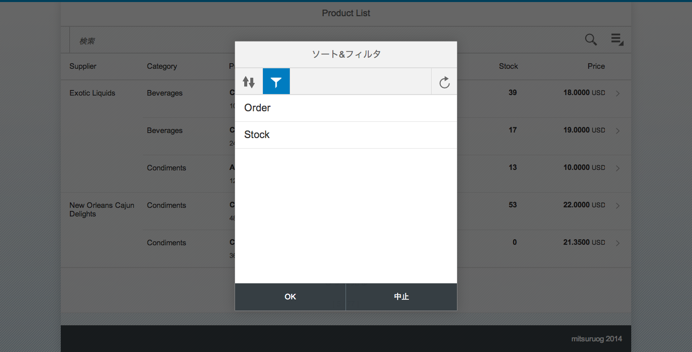
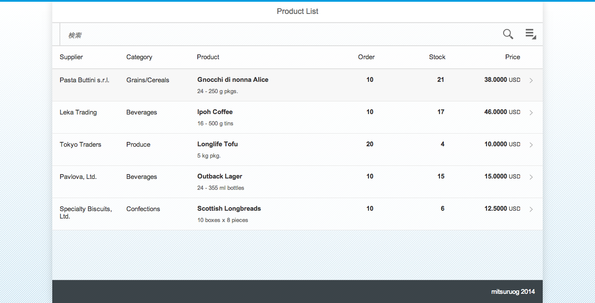
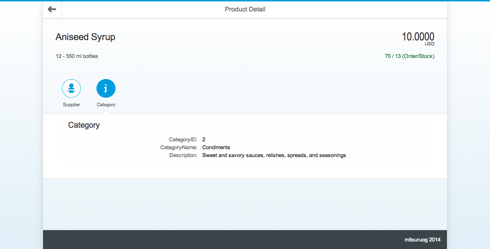

OpenUI5とODataを使ってWebアプリケーションを作る
=========================
OpenUI5とOdataServiceをWebアプリケーションとしてどのように統合すればよいか。

How to integrate OdataService in OpenUI5


# <a name="table">目次</a>

1. [はじめに](#intro)
1. [なぜODataが注目されるべきなのか？](#whatisOdata)
1. [ODataの基本](#basic)
1. [ODataServiceをURLで操作する](#manipulating)
1. [OpenUI5とODataServiceの統合](#openui5withodata)
	- 5.1. [導入・準備](#install)  
	- 5.2. [プロジェクトの説明](#project)
	- 5.3. [商品リストの実装](#productlist_impl)
		* 5.3.a [商品リストの取得](#productlist)  
		* 5.3.b [商品名での検索](#search)  
		* 5.3.c [商品リストのソート、フィルタ](#sortandfilter)  
	- 5.4. [商品詳細の実装](#product_impl)
		* 5.4.a [商品情報の参照](#product)
		* 5.4.b [カテゴリー情報とメーカー情報の参照](#category)  
1. [まとめ](#summary)  

# <a name="intro">1. はじめに</a>

このチュートリアルはOpenUI5とODataServiceを利用したWebアプリケーションを構築する上で、ODataをOpenUI5内でどのように扱えば良いかを中心に行います。  

特にODataが持つURLパラメータを組み合わせによる柔軟なデータアクセス方法と、OpenUI5というUIフレームワークを組み合わせた場合に実現できる、データアクセスからUIへのフィードバックがシームレスに統合され隠蔽された、これからの企業向けWebアプリケーション開発における「OpenUI5＋ODataService」という新しい可能性（選択肢）を感じてもらえればと思います。

OpenUI5のサポートが「V2」までであるため、ODataのバージョンは「2」を前提に説明します。

<a name="whatisodata">2. なぜODataが注目されるべきなのか？</a>
========

まず、なぜ今ODataが注目されるべきなのか、OpenUI5というUIフレームワークとODataが統合された時、何かメリットなのか少し背景など話しながら理解していきましょう。

### ODataとは何か？

<http://www.odata.org/> - Odata公式より。

> OData is a standardized protocol for creating and consuming data APIs. OData builds on core protocols like HTTP and commonly accepted methodologies like REST. The result is a uniform way to expose full-featured data APIs.  

> ODataとはデータAPIを作成し利用するために標準化されたプロトコルです。ODataはHTTPプロトコルと、一般的に浸透しているRESTという方法論で構成されています。つまり、これらのフル機能を満たすDataAPIを公開するために統一された方法です。

つまり、

「Webシステムにおける、フロントエンドとバックエンドとの面倒なAjax問い合わせの手続きを標準化したプロトコル」

プロトコルと言われてますが難しく捉える必要はありません。  
まったく新しい概念ではなく、既存のよくあるAjax上のやり取りを仕様化したものだと思っていただいて結構です。

旧来から、システムをいくつかのレイアー構造で分割し、レイアーをまたがる部分を抽象化、標準化する動きはよく見られました。  
代表的なものでは、アプリケーションからRDBMSへのデータアクセスの方法を標準化したODBCが存在します。  
「OData」は、フロントエンドからバックエンドへのデータアクセスを標準化した、いわばODBCのWeb版です。ODataはMicrosoft、IBM、SAP、Citrix社が中心となりデータアクセスプロトコルの業界標準となるよう動いています。 

ODataに関する情報はこちらが公式サイトはこちらです。  
<http://www.odata.org/>

### 昨今のWeb開発の流れ

昨今、Ajaxの登場によりWebアプリケーションにおいて、フロントエンドの重要性が増してきていることは周知の事実かと思います。  
それに伴ってフロントエンドの実装が高度化、複雑化してきたこともあり、ソリューションの1つとして様々なクライアントMVCフレームワーク（以下、クライアントMVC）が台頭してきました。

現在は、いくつかのクライアントMVCを中心とするフロントエンド開発のエコシステムができつつあり、今後の企業向けWebシステムにて普及・活用していくためには、もう一歩踏み込んだ、バックエンドのWebAPIとの間のベストプラクティスの蓄積と標準化、そして統合ソリューションが必要だと感じています。  

### データアクセス方法を標準化するODataの登場

ODataは、企業向けWebアプリケーションをターゲットに様々なデータアクセス方法を標準化しています。今後の企業向けWebアプリケーションの構築にて、様々なデータアクセスに対する柔軟に対応でき、現時点で非常に可能性を感じる仕様です。

では、実際に今までのクライアントMVCを利用した場合と比較して、ODataを利用した場合、どの辺りにメリットを感じるか話します。

まず、今までのクライアントMVCを利用した場合のアプリケーション構築イメージです。


ODataを使わない場合、フロントエンドを構築する一部にクライアントMVCが導入され、クライアントMVCを中心に統合されている状態でした。しかし、バックエンドとのWebAPIの設計、実装についてはそれぞれの案件ごとに対応している状況で、バックエンドも含めた形の統合とはほど遠い姿でした。

ではODataを利用した場合はどうでしょうか？


ODataを利用する場合、バックエンドがカスタムのWebAPIからOdataServiceと呼ばれるものに置き換わり、フロントエンドとバックエンドのデータアクセスについて標準化とライブラリによる隠蔽が可能です。  
（ちなみに、JavascriptにてODataを利用する場合、デファクトなJavascriptライブラリは[datajs](http://datajs.codeplex.com/)です。）  
しかし、ODataに対するURLパラメータの設定や、ODataから受け取ったデータのUIへのレンダリングは実装する必要があり、ODataのメリットより仕様の複雑さの方が目立つ状況でした。
このような状況のためか、ODataに対する世間の注目度はいまいちだったような気がします。

### UIプレームワークとODataの統合

そこで登場したものがODataをサポートするUIフレームの登場です。  
ここでのUIフレームワークとは、従来のクライアントMVCの機能を持ち、UIコンポーネントも持つものです。  
特徴としては、WebAPIから取得したデータを元に自動でUIを構築し、UI側の操作をダイレクトにバックエンドに連携できる機能を持っています。  
ODataをサポートする代表的なUIフレームワークとしてOpenUI5があります。

OpenUI5とODataを組み合わせた場合は次のようになります。


ODataとOpenUI5を組み合わせることで、バックエンドのデータアクセス部分からUIの変更まで隠蔽することが可能となりました。  
アプリケーション開発者は面倒なバックエンドとの同期について頭を悩ませる事なく、ビジネスロジックの構築に専念できます。

このようにバックエンドとフロントエンドを統合した形は、企業向けWebアプリケーション構築のソリューションとして可能性を感じます。  
OpenUI5というパートナーを得たことで、ODataの仕様は本当の意味で「使える」ものになりました。

**[[⬆]](#table)**

<a name="basic">3. ODataの基本</a>
========

ODataはHTTPをベースに構成されているため、1つのバックエンドとのやり取りを見る限る通常のHTTPとなんら変わりはありません。  
バックエンドへの問い合わせは通常の`GET`、`POST`、`PUT`、`DELETE`で行い、返されるデータも`xml`、 `json`、`atom`形式です。

しかし、ODataはバックエンドとの間の複数のHTTP問い合わせを統合して標準化しています。そしてODataを返すバックエンドがODataServiceと呼ばれるものです。  
ODataServiceは、内部に「インターフェース層」「実体化層」「抽象化層」の3つで構成されています。フロントエンドがODataServiceにアクセスする際は、ODataのデータモデルを提供する「Metadata」か、実際のデータAPIインターフェース「EntityConteiner」のどちらかを呼び出します。

こちらが、ODataServiceについての概念図です。  

（上の内容については、筆者の独自の解釈が含まれています。誤りがある可能性があります。）

ODataを理解する上では、特にデータモデルの構造を理解する事が重要です。まずMetadataを見ながらのODataのデータモデルについて基本的なことを理解しましょう。

今回のチュートリアルで利用するNorthwindのMetadataをベースに進めていきます。Metadataはこちらで確認できます。  

<http://services.odata.org/V2/Northwind/Northwind.svc/$metadata>

## EntityTypeとEntities

### EntityType

EntityTypeはODataを構成する最も小さなデータ構造体です。Northwindの`Category`と`Product`のEntityTypeを見てみます。

*Category*
````xml
<EntityType Name="Category">
	<Key>
		<PropertyRef Name="CategoryID"/>
	</Key>
	<Property xmlns:p8="http://schemas.microsoft.com/ado/2009/02/edm/annotation" Name="CategoryID" Type="Edm.Int32" Nullable="false" p8:StoreGeneratedPattern="Identity"/>
	<Property Name="CategoryName" Type="Edm.String" Nullable="false" MaxLength="15" Unicode="true" FixedLength="false"/>
	<Property Name="Description" Type="Edm.String" Nullable="true" MaxLength="Max" Unicode="true" FixedLength="false"/>
	<Property Name="Picture" Type="Edm.Binary" Nullable="true" MaxLength="Max" FixedLength="false"/>
	<NavigationProperty Name="Products" Relationship="NorthwindModel.FK_Products_Categories" FromRole="Categories" ToRole="Products"/>
</EntityType>
````

*Product*
````xml
<EntityType Name="Product">
	<Key>
		<PropertyRef Name="ProductID"/>
	</Key>
	<Property xmlns:p8="http://schemas.microsoft.com/ado/2009/02/edm/annotation" Name="ProductID" Type="Edm.Int32" Nullable="false" p8:StoreGeneratedPattern="Identity"/>
	<Property Name="ProductName" Type="Edm.String" Nullable="false" MaxLength="40" Unicode="true" FixedLength="false"/>
	<Property Name="SupplierID" Type="Edm.Int32" Nullable="true"/>
	<Property Name="CategoryID" Type="Edm.Int32" Nullable="true"/>
	<Property Name="QuantityPerUnit" Type="Edm.String" Nullable="true" MaxLength="20" Unicode="true" FixedLength="false"/>
	<Property Name="UnitPrice" Type="Edm.Decimal" Nullable="true" Precision="19" Scale="4"/>
	<Property Name="UnitsInStock" Type="Edm.Int16" Nullable="true"/>
	<Property Name="UnitsOnOrder" Type="Edm.Int16" Nullable="true"/>
	<Property Name="ReorderLevel" Type="Edm.Int16" Nullable="true"/>
	<Property Name="Discontinued" Type="Edm.Boolean" Nullable="false"/>
	<NavigationProperty Name="Category" Relationship="NorthwindModel.FK_Products_Categories" FromRole="Products" ToRole="Categories"/>
	<NavigationProperty Name="Order_Details" Relationship="NorthwindModel.FK_Order_Details_Products" FromRole="Products" ToRole="Order_Details"/>
	<NavigationProperty Name="Supplier" Relationship="NorthwindModel.FK_Products_Suppliers" FromRole="Products" ToRole="Suppliers"/>
</EntityType>
````
`EntityType`の中に`key`と`Property`が存在するような、良く見るデータ構造体です。  
`NavigationProperty`はこのEntityTypeが他のEntityTypeと関連がある場合の情報で、RDBMSの外部キーのようなものです。後述する`Association`とセットで利用されます。

### Entities

EntitiesはEntityTypeのデータ構造体を実際のデータにしたものです。 
Javaで置き換えるとクラスがEntityTypeで、Entitiesはそのインスタンスに該当します。そのため、Entitiesはリストになるケースが多いです。
以下が、`Product`のEntitiesの抜粋です。  
<http://services.odata.org/V2/Northwind/Northwind.svc/Products?$format=json>

````javascript
{
	"d": {
		"results": [{
				"__metadata": {
					"uri": "http://services.odata.org/V2/Northwind/Northwind.svc/Products(1)",
					"type": "NorthwindModel.Product"
				},
				"ProductID": 1,
				"ProductName": "Chai",
				"SupplierID": 1,
				"CategoryID": 1,
				"QuantityPerUnit": "10 boxes x 20 bags",
				"UnitPrice": "18.0000",
				"UnitsInStock": 39,
				"UnitsOnOrder": 0,
				"ReorderLevel": 10,
				"Discontinued": false,
				"Category": {
					"__deferred": {
						"uri": "http://services.odata.org/V2/Northwind/Northwind.svc/Products(1)/Category"
					}
				},
				"Order_Details": {
					"__deferred": {
						"uri": "http://services.odata.org/V2/Northwind/Northwind.svc/Products(1)/Order_Details"
					}
				},
				"Supplier": {
					"__deferred": {
						"uri": "http://services.odata.org/V2/Northwind/Northwind.svc/Products(1)/Supplier"
					}
				}
			},

		...

````
注目は、問い合わせURLが`Product`ではなく`Products`となっているところです。こちらは、後述する`EntitySet`にて取り上げます。

## Association

### Association

2つ以上のEntiryTypeの関連を定義したものです。RDBMSのスキーマ定義における外部キーに相当します。先ほどの2つのEntityType`Category`と`Entity`には関連がありますので、それを見てみましょう。

````xml
<Association Name="FK_Products_Categories">
	<End Role="Categories" Type="NorthwindModel.Category" Multiplicity="0..1"/>
	<End Role="Products" Type="NorthwindModel.Product" Multiplicity="*"/>
	<ReferentialConstraint>
		<Principal Role="Categories">
			<PropertyRef Name="CategoryID"/>
		</Principal>
		<Dependent Role="Products">
			<PropertyRef Name="CategoryID"/>
		</Dependent>
	</ReferentialConstraint>
</Association>
````
2つの関連するEntityTypeとそれぞれのKeyが定義されています。`Multiplicity`にて関連の多重度が定義されています。いままでRDBMSに携わっていた方であれば、容易に理解できると思います。

## EntityConteinerとAssociationSet、EntitySet

### EntityConteiner

ODataServiceが外部に公開するI/Fを納めたコンテナ定義です。  
上で挙げた`EntityType`や`Association`はODataService内部の定義であって、外部の利用者はEntityConteinerにて公開されているI/Fを利用します。

### EntitySet

EntityTypeの外部公開I/F名。`Product`の場合、EntitySetの名前が`Products`となっているため、外部からアクセスする場合は`Products`を利用します。慣例でEntityTypeの複数系で、Entitiesを表すことが多いようです。

以下にEntityConteinerとEntitySetを抜粋します。

````xml
<Schema xmlns:d="http://schemas.microsoft.com/ado/2007/08/dataservices" xmlns:m="http://schemas.microsoft.com/ado/2007/08/dataservices/metadata" xmlns="http://schemas.microsoft.com/ado/2008/09/edm" Namespace="ODataWeb.Northwind.Model">
	<EntityContainer xmlns:p7="http://schemas.microsoft.com/ado/2009/02/edm/annotation" Name="NorthwindEntities" p7:LazyLoadingEnabled="true" m:IsDefaultEntityContainer="true">
		<EntitySet Name="Categories" EntityType="NorthwindModel.Category"/>
		<EntitySet Name="CustomerDemographics" EntityType="NorthwindModel.CustomerDemographic"/>
		<EntitySet Name="Customers" EntityType="NorthwindModel.Customer"/>
		<EntitySet Name="Employees" EntityType="NorthwindModel.Employee"/>
		<EntitySet Name="Order_Details" EntityType="NorthwindModel.Order_Detail"/>
		<EntitySet Name="Orders" EntityType="NorthwindModel.Order"/>
		<EntitySet Name="Products" EntityType="NorthwindModel.Product"/>

		...

	</EntityContainer>
</Schema>
````

### AssociationSet

EntitySetと同じくAssociationの外部公開I/F名。以下が`FK_Products_Categories`のAssociationSet定義です。AssociationSetもEntityConteiner内部に格納されています。


````xml
<AssociationSet Name="FK_Products_Categories" Association="NorthwindModel.FK_Products_Categories">
	<End Role="Categories" EntitySet="Categories"/>
	<End Role="Products" EntitySet="Products"/>
</AssociationSet>
````

ODataを利用した実際の開発では、このようにODataServiceが提供するMetadataを参照しながら行っていきます。  
これまでのWeb開発での、RDBMSのスキーマ定義を参照しながら開発することと何ら変わりない事が理解できると思います。

**[[⬆]](#table)**

<a name="manipulating">4. ODataServiceをURLで操作する</a>
========

早速、ODataServiceを操作してみましょう。先述した通り、ODataはデータAPIであるため、ブラウザのアドレスバーにURLを入力することによってアクセスすることが出来ます。 
URLのクエリパラメータをいくつか追加していくことでODataServiceの振る舞いを柔軟に変える事が出来ます。実際に検索、ページングなどデータの取得シーンを想定し、ODataが利用するメリットを十分体験してみてください。  

ODataServiceはNorthwindを利用します。Metadataを確認する場合はこちらを参照してください。
<http://services.odata.org/V2/Northwind/Northwind.svc/$metadata>

> ブラウザではなくデータAPIのテスト専用に作られたRESTクライアントツールを利用することを推奨します。こちらのChrome extentionsの[POATMAN](https://chrome.google.com/webstore/detail/postman-rest-client/fdmmgilgnpjigdojojpjoooidkmcomcm)は、非常に操作しやすくRESTクライアントとして一番のおすすめです。  
ブラウザのみでデータアクセスする際は、こちらのChrome extentionsの[JSONVIew](https://chrome.google.com/webstore/detail/jsonview/chklaanhfefbnpoihckbnefhakgolnmc)だけでもインストールしておくといいでしょう。

## OdataService

### EntityConteiner(endpoint)

では、ODataServiceが提供するEntityConteinerの情報を取得します。このURLが以降のデータアクセスのルートとなるため、以降endpointと呼びます。  
<http://services.odata.org/V2/Northwind/Northwind.svc/>

結果は以下の通りです。  
（レスポンスで取得した結果のデータが非常に大きいため、中身を割愛しながら説明していきます。ご了承ください。）

````xml
<?xml version="1.0" encoding="utf-8" standalone="yes"?>
<service xml:base="http://services.odata.org/V2/Northwind/Northwind.svc/" 
    xmlns:atom="http://www.w3.org/2005/Atom" 
    xmlns:app="http://www.w3.org/2007/app" 
    xmlns="http://www.w3.org/2007/app">
    <workspace>
        <atom:title>Default</atom:title>
        <collection href="Categories">
            <atom:title>Categories</atom:title>
        </collection>
        <collection href="CustomerDemographics">
            <atom:title>CustomerDemographics</atom:title>
        </collection>
        <collection href="Customers">
            <atom:title>Customers</atom:title>
        </collection>
        <collection href="Employees">
            <atom:title>Employees</atom:title>
        </collection>
        <collection href="Order_Details">
            <atom:title>Order_Details</atom:title>
        </collection>
        <collection href="Orders">
            <atom:title>Orders</atom:title>
        </collection>
        <collection href="Products">
            <atom:title>Products</atom:title>
        </collection>
        <collection href="Regions">
            <atom:title>Regions</atom:title>
        </collection>

        ...

    </workspace>
</service>
````
これがNorthwindのODataServiceが提供するデータアクセスAPIのインターフェース定義です。  
より詳細な内容は次の`Metadata`を取得して確認します。

**[[⬆]](#table)**

### Metadata
Metadataを取得するためにはendpointのURLの後ろに`$metadata`を付与します。  
<http://services.odata.org/V2/Northwind/Northwind.svc/$metadata>

結果は以下の通りです。
````xml
<?xml version="1.0" encoding="utf-8" standalone="yes"?>
<edmx:Edmx Version="1.0" 
    xmlns:edmx="http://schemas.microsoft.com/ado/2007/06/edmx">
  <edmx:DataServices 
        xmlns:m="http://schemas.microsoft.com/ado/2007/08/dataservices/metadata" m:DataServiceVersion="1.0">
    <Schema Namespace="NorthwindModel" 
            xmlns:d="http://schemas.microsoft.com/ado/2007/08/dataservices" 
            xmlns:m="http://schemas.microsoft.com/ado/2007/08/dataservices/metadata" 
            xmlns="http://schemas.microsoft.com/ado/2008/09/edm">
      <EntityType Name="Category">
        <Key>
          <PropertyRef Name="CategoryID" />
        </Key>
        <Property Name="CategoryID" Type="Edm.Int32" Nullable="false" p8:StoreGeneratedPattern="Identity" 
                    xmlns:p8="http://schemas.microsoft.com/ado/2009/02/edm/annotation" />
        <Property Name="CategoryName" Type="Edm.String" Nullable="false" MaxLength="15" Unicode="true" FixedLength="false" />
        <Property Name="Description" Type="Edm.String" Nullable="true" MaxLength="Max" Unicode="true" FixedLength="false" />
        <Property Name="Picture" Type="Edm.Binary" Nullable="true" MaxLength="Max" FixedLength="false" />
        <NavigationProperty Name="Products" Relationship="NorthwindModel.FK_Products_Categories" FromRole="Categories" ToRole="Products" />
      </EntityType>

      ...

      <Association Name="FK_Products_Categories">
        <End Role="Categories" Type="NorthwindModel.Category" Multiplicity="0..1" />
        <End Role="Products" Type="NorthwindModel.Product" Multiplicity="*" />
        <ReferentialConstraint>
          <Principal Role="Categories">
            <PropertyRef Name="CategoryID" />
          </Principal>
          <Dependent Role="Products">
            <PropertyRef Name="CategoryID" />
          </Dependent>
        </ReferentialConstraint>
      </Association>

      ...

    </Schema>
    <Schema Namespace="ODataWeb.Northwind.Model" 
                                        xmlns:d="http://schemas.microsoft.com/ado/2007/08/dataservices" 
                                        xmlns:m="http://schemas.microsoft.com/ado/2007/08/dataservices/metadata" 
                                        xmlns="http://schemas.microsoft.com/ado/2008/09/edm">
      <EntityContainer Name="NorthwindEntities" p7:LazyLoadingEnabled="true" m:IsDefaultEntityContainer="true" 
                                            xmlns:p7="http://schemas.microsoft.com/ado/2009/02/edm/annotation">
        <EntitySet Name="Categories" EntityType="NorthwindModel.Category" />
        <EntitySet Name="CustomerDemographics" EntityType="NorthwindModel.CustomerDemographic" />
        <EntitySet Name="Customers" EntityType="NorthwindModel.Customer" />
        <EntitySet Name="Employees" EntityType="NorthwindModel.Employee" />
        <EntitySet Name="Order_Details" EntityType="NorthwindModel.Order_Detail" />
        
        ...

        <AssociationSet Name="FK_Products_Categories" Association="NorthwindModel.FK_Products_Categories">
          <End Role="Categories" EntitySet="Categories" />
          <End Role="Products" EntitySet="Products" />
        </AssociationSet>

        ...

      </EntityContainer>
    </Schema>
  </edmx:DataServices>
</edmx:Edmx>
````
MetadataはXMLで返されます。  
OdataServiceは複数のEntityを統合して公開できる能力を持っているため、複数のEntityを利用する場合は、EntityごとにODataServiceを作成してクライアントマッシュアップで統合するよりは、単一のODataServiceの中に含めてしまう方が経験的に良いと考えています。

**[[⬆]](#table)**

## Entitiesアクセス

### Entities
では、ProductsのEntitiesを取得してみましょう。 
EntitiesにアクセスするためにはendpointのURLの後ろに`EntitySet名`を付与します。   
<http://services.odata.org/V2/Northwind/Northwind.svc/Products>

結果は以下の通りです。
````xml
<?xml version="1.0" encoding="utf-8" standalone="yes"?>
<feed xml:base="http://services.odata.org/V2/Northwind/Northwind.svc/" 
    xmlns:d="http://schemas.microsoft.com/ado/2007/08/dataservices" 
    xmlns:m="http://schemas.microsoft.com/ado/2007/08/dataservices/metadata" 
    xmlns="http://www.w3.org/2005/Atom">
  <title type="text">Products</title>
  <id>
    http://services.odata.org/V2/Northwind/Northwind.svc/Products
  </id>
  <updated>2014-07-20T14:26:33Z</updated>
  <link rel="self" title="Products" href="Products" />
  <entry>
    <id>
      http://services.odata.org/V2/Northwind/Northwind.svc/Products(1)
    </id>
    <title type="text"></title>
    <updated>2014-07-20T14:26:33Z</updated>
    <author>
      <name />
    </author>
    <link rel="edit" title="Product" href="Products(1)" />
    <link rel="http://schemas.microsoft.com/ado/2007/08/dataservices/related/Category" type="application/atom+xml;type=entry" title="Category" href="Products(1)/Category" />
    <link rel="http://schemas.microsoft.com/ado/2007/08/dataservices/related/Order_Details" type="application/atom+xml;type=feed" title="Order_Details" href="Products(1)/Order_Details" />
    <link rel="http://schemas.microsoft.com/ado/2007/08/dataservices/related/Supplier" type="application/atom+xml;type=entry" title="Supplier" href="Products(1)/Supplier" />
    <category term="NorthwindModel.Product" scheme="http://schemas.microsoft.com/ado/2007/08/dataservices/scheme" />
    <content type="application/xml">
      <m:properties>
        <d:ProductID m:type="Edm.Int32">1</d:ProductID>
        <d:ProductName m:type="Edm.String">Chai</d:ProductName>
        <d:SupplierID m:type="Edm.Int32">1</d:SupplierID>
        <d:CategoryID m:type="Edm.Int32">1</d:CategoryID>
        <d:QuantityPerUnit m:type="Edm.String">10 boxes x 20 bags</d:QuantityPerUnit>
        <d:UnitPrice m:type="Edm.Decimal">18.0000</d:UnitPrice>
        <d:UnitsInStock m:type="Edm.Int16">39</d:UnitsInStock>
        <d:UnitsOnOrder m:type="Edm.Int16">0</d:UnitsOnOrder>
        <d:ReorderLevel m:type="Edm.Int16">10</d:ReorderLevel>
        <d:Discontinued m:type="Edm.Boolean">false</d:Discontinued>
      </m:properties>
    </content>
  </entry>

  ...

</feed>
````

### $format
先ほどのデータはXML形式でしたので、JSONで取得してみましょう。URLパラメータに`$format=json`を渡します。  
<http://services.odata.org/V2/Northwind/Northwind.svc/Products?$format=json>

結果は以下の通りです。
````js
{
  "d": {
    "results": [{
        "__metadata": {
          "uri": "http://services.odata.org/V2/Northwind/Northwind.svc/Products(1)",
          "type": "NorthwindModel.Product"
        },
        "ProductID": 1,
        "ProductName": "Chai",
        "SupplierID": 1,
        "CategoryID": 1,
        "QuantityPerUnit": "10 boxes x 20 bags",
        "UnitPrice": "18.0000",
        "UnitsInStock": 39,
        "UnitsOnOrder": 0,
        "ReorderLevel": 10,
        "Discontinued": false,
        "Category": {
          "__deferred": {
            "uri": "http://services.odata.org/V2/Northwind/Northwind.svc/Products(1)/Category"
          }
        },
        "Order_Details": {
          "__deferred": {
            "uri": "http://services.odata.org/V2/Northwind/Northwind.svc/Products(1)/Order_Details"
          }
        },
        "Supplier": {
          "__deferred": {
            "uri": "http://services.odata.org/V2/Northwind/Northwind.svc/Products(1)/Supplier"
          }
        }
      },

      ...

````
`$format`パラメータを渡すことでレスポンスのデータ形式を指定できます。以降のURLアクセスはJSONで行います。

### $select
次に取得データ項目の取捨選択の方法です。  
プルダウンを作るためにデータ取得する想定だとします。先ほどのデータでは必要ない項目まで取得されてしまうため、必要な項目だけにしぼってデータを取得しましょう。今回はProductIDとProductNameが欲しいとします。URLパラメータに`$select=ProductID,ProductName`を渡します。  
<http://services.odata.org/V2/Northwind/Northwind.svc/Products?$format=json&$select=ProductID,ProductName>

結果は以下の通りです。
````js
{
  "d": {
    "results": [{
        "__metadata": {
          "uri": "http://services.odata.org/V2/Northwind/Northwind.svc/Products(1)",
          "type": "NorthwindModel.Product"
        },
        "ProductID": 1,
        "ProductName": "Chai"
      }, {
        "__metadata": {
          "uri": "http://services.odata.org/V2/Northwind/Northwind.svc/Products(2)",
          "type": "NorthwindModel.Product"
        },
        "ProductID": 2,
        "ProductName": "Chang"
      }, {
        "__metadata": {
          "uri": "http://services.odata.org/V2/Northwind/Northwind.svc/Products(3)",
          "type": "NorthwindModel.Product"
        },
        "ProductID": 3,
        "ProductName": "Aniseed Syrup"
      },

       ...

````
`$select`に複数のデータ項目を渡したい場合は`,（カンマ）`で区切って渡してください。後述するNavigationを絡めた複雑なパターンにも対応できます。

### $count
問い合わせるデータの件数を取得したい場合はURLに`$count`を付与します。  
<http://services.odata.org/V2/Northwind/Northwind.svc/Products/$count>

結果は以下の通りです。
````js
77
````

### $top
ここからはページングを想定したデータアクセスを想定して話を進めていきます。  
3件ごとにページ遷移すると仮定して最初の5件を取得します。URLパラメータに`$top=3`を渡します。  
<http://services.odata.org/V2/Northwind/Northwind.svc/Products?$format=json&$top=3>

結果は以下の通りです。
````js
{
  "d": [{
    "__metadata": {
      "uri": "http://services.odata.org/V2/Northwind/Northwind.svc/Products(1)",
      "type": "NorthwindModel.Product"
    },
    "ProductID": 1,
    "ProductName": "Chai",
    "SupplierID": 1,
    "CategoryID": 1,
    "QuantityPerUnit": "10 boxes x 20 bags",
    "UnitPrice": "18.0000",
    "UnitsInStock": 39,
    "UnitsOnOrder": 0,
    "ReorderLevel": 10,
    "Discontinued": false,
    "Category": {
      "__deferred": {
        "uri": "http://services.odata.org/V2/Northwind/Northwind.svc/Products(1)/Category"
      }
    },
    "Order_Details": {
      "__deferred": {
        "uri": "http://services.odata.org/V2/Northwind/Northwind.svc/Products(1)/Order_Details"
      }
    },
    "Supplier": {
      "__deferred": {
        "uri": "http://services.odata.org/V2/Northwind/Northwind.svc/Products(1)/Supplier"
      }
    }
  }, {
    "__metadata": {
      "uri": "http://services.odata.org/V2/Northwind/Northwind.svc/Products(2)",
      "type": "NorthwindModel.Product"
    },
    "ProductID": 2,
    "ProductName": "Chang",
    "SupplierID": 1,
    "CategoryID": 1,
    "QuantityPerUnit": "24 - 12 oz bottles",
    "UnitPrice": "19.0000",
    "UnitsInStock": 17,
    "UnitsOnOrder": 40,
    "ReorderLevel": 25,
    "Discontinued": false,
    "Category": {
      "__deferred": {
        "uri": "http://services.odata.org/V2/Northwind/Northwind.svc/Products(2)/Category"
      }
    },
    "Order_Details": {
      "__deferred": {
        "uri": "http://services.odata.org/V2/Northwind/Northwind.svc/Products(2)/Order_Details"
      }
    },
    "Supplier": {
      "__deferred": {
        "uri": "http://services.odata.org/V2/Northwind/Northwind.svc/Products(2)/Supplier"
      }
    }
  }, {
    "__metadata": {
      "uri": "http://services.odata.org/V2/Northwind/Northwind.svc/Products(3)",
      "type": "NorthwindModel.Product"
    },
    "ProductID": 3,
    "ProductName": "Aniseed Syrup",
    "SupplierID": 1,
    "CategoryID": 2,
    "QuantityPerUnit": "12 - 550 ml bottles",
    "UnitPrice": "10.0000",
    "UnitsInStock": 13,
    "UnitsOnOrder": 70,
    "ReorderLevel": 25,
    "Discontinued": false,
    "Category": {
      "__deferred": {
        "uri": "http://services.odata.org/V2/Northwind/Northwind.svc/Products(3)/Category"
      }
    },
    "Order_Details": {
      "__deferred": {
        "uri": "http://services.odata.org/V2/Northwind/Northwind.svc/Products(3)/Order_Details"
      }
    },
    "Supplier": {
      "__deferred": {
        "uri": "http://services.odata.org/V2/Northwind/Northwind.svc/Products(3)/Supplier"
      }
    }
  }]
}
````
ProductIDが`1~3`の3件取得していることが分かります。

### $skip
では次の3件を取得します。URLパラメータに`$top=3&$skip=3`を渡します。
$skipを指定することで最初の5件をスキップします。  
<http://services.odata.org/V2/Northwind/Northwind.svc/Products?$format=json&$top=3&$skip=3>

結果は以下の通りです。
````js
{
  "d": [{
    "__metadata": {
      "uri": "http://services.odata.org/V2/Northwind/Northwind.svc/Products(4)",
      "type": "NorthwindModel.Product"
    },
    "ProductID": 4,
    "ProductName": "Chef Anton's Cajun Seasoning",
    "SupplierID": 2,
    "CategoryID": 2,
    "QuantityPerUnit": "48 - 6 oz jars",
    "UnitPrice": "22.0000",
    "UnitsInStock": 53,
    "UnitsOnOrder": 0,
    "ReorderLevel": 0,
    "Discontinued": false,
    "Category": {
      "__deferred": {
        "uri": "http://services.odata.org/V2/Northwind/Northwind.svc/Products(4)/Category"
      }
    },
    "Order_Details": {
      "__deferred": {
        "uri": "http://services.odata.org/V2/Northwind/Northwind.svc/Products(4)/Order_Details"
      }
    },
    "Supplier": {
      "__deferred": {
        "uri": "http://services.odata.org/V2/Northwind/Northwind.svc/Products(4)/Supplier"
      }
    }
  }, {
    "__metadata": {
      "uri": "http://services.odata.org/V2/Northwind/Northwind.svc/Products(5)",
      "type": "NorthwindModel.Product"
    },
    "ProductID": 5,
    "ProductName": "Chef Anton's Gumbo Mix",
    "SupplierID": 2,
    "CategoryID": 2,
    "QuantityPerUnit": "36 boxes",
    "UnitPrice": "21.3500",
    "UnitsInStock": 0,
    "UnitsOnOrder": 0,
    "ReorderLevel": 0,
    "Discontinued": true,
    "Category": {
      "__deferred": {
        "uri": "http://services.odata.org/V2/Northwind/Northwind.svc/Products(5)/Category"
      }
    },
    "Order_Details": {
      "__deferred": {
        "uri": "http://services.odata.org/V2/Northwind/Northwind.svc/Products(5)/Order_Details"
      }
    },
    "Supplier": {
      "__deferred": {
        "uri": "http://services.odata.org/V2/Northwind/Northwind.svc/Products(5)/Supplier"
      }
    }
  }, {
    "__metadata": {
      "uri": "http://services.odata.org/V2/Northwind/Northwind.svc/Products(6)",
      "type": "NorthwindModel.Product"
    },
    "ProductID": 6,
    "ProductName": "Grandma's Boysenberry Spread",
    "SupplierID": 3,
    "CategoryID": 2,
    "QuantityPerUnit": "12 - 8 oz jars",
    "UnitPrice": "25.0000",
    "UnitsInStock": 120,
    "UnitsOnOrder": 0,
    "ReorderLevel": 25,
    "Discontinued": false,
    "Category": {
      "__deferred": {
        "uri": "http://services.odata.org/V2/Northwind/Northwind.svc/Products(6)/Category"
      }
    },
    "Order_Details": {
      "__deferred": {
        "uri": "http://services.odata.org/V2/Northwind/Northwind.svc/Products(6)/Order_Details"
      }
    },
    "Supplier": {
      "__deferred": {
        "uri": "http://services.odata.org/V2/Northwind/Northwind.svc/Products(6)/Supplier"
      }
    }
  }]
}
````
今度はProductIDが`4~6`の3件取得していることが分かります。

### $orderby
次は、orderby指定をしてみます。`ProductID`の降順を指定します。URLパラメータに`$orderby=ProductID desc`を渡します。  
<http://services.odata.org/V2/Northwind/Northwind.svc/Products?$format=json&$orderby=ProductID desc>

結果は以下の通りです。
````js
{
  "d": {
    "results": [{
        "__metadata": {
          "uri": "http://services.odata.org/V2/Northwind/Northwind.svc/Products(77)",
          "type": "NorthwindModel.Product"
        },
        "ProductID": 77,
        "ProductName": "Original Frankfurter grüne Soße",
        "SupplierID": 12,
        "CategoryID": 2,
        "QuantityPerUnit": "12 boxes",
        "UnitPrice": "13.0000",
        "UnitsInStock": 32,
        "UnitsOnOrder": 0,
        "ReorderLevel": 15,
        "Discontinued": false,
        "Category": {
          "__deferred": {
            "uri": "http://services.odata.org/V2/Northwind/Northwind.svc/Products(77)/Category"
          }
        },
        "Order_Details": {
          "__deferred": {
            "uri": "http://services.odata.org/V2/Northwind/Northwind.svc/Products(77)/Order_Details"
          }
        },
        "Supplier": {
          "__deferred": {
            "uri": "http://services.odata.org/V2/Northwind/Northwind.svc/Products(77)/Supplier"
          }
        }
      }, {
        "__metadata": {
          "uri": "http://services.odata.org/V2/Northwind/Northwind.svc/Products(76)",
          "type": "NorthwindModel.Product"
        },
        "ProductID": 76,
        "ProductName": "Lakkalikööri",
        "SupplierID": 23,
        "CategoryID": 1,
        "QuantityPerUnit": "500 ml",
        "UnitPrice": "18.0000",
        "UnitsInStock": 57,
        "UnitsOnOrder": 0,
        "ReorderLevel": 20,
        "Discontinued": false,
        "Category": {
          "__deferred": {
            "uri": "http://services.odata.org/V2/Northwind/Northwind.svc/Products(76)/Category"
          }
        },
        "Order_Details": {
          "__deferred": {
            "uri": "http://services.odata.org/V2/Northwind/Northwind.svc/Products(76)/Order_Details"
          }
        },
        "Supplier": {
          "__deferred": {
            "uri": "http://services.odata.org/V2/Northwind/Northwind.svc/Products(76)/Supplier"
          }
        }
      },

      ...

````
`$orderby`のパラメータには`プロパティ名 順序`を指定します、順序を指定しない場合は`asc`指定となります。  
複数指定する場合は`,(カンマ)`で区切って指定してください。  
試しにSupplierID, CategoryIDの昇順でデータを取得しましょう。  
<http://services.odata.org/V2/Northwind/Northwind.svc/Products?$format=json&$orderby=SupplierID, CategoryID>

結果は以下の通りです。
````js
{
  "d": {
    "results": [{
        "__metadata": {
          "uri": "http://services.odata.org/V2/Northwind/Northwind.svc/Products(1)",
          "type": "NorthwindModel.Product"
        },
        "ProductID": 1,
        "ProductName": "Chai",
        "SupplierID": 1,
        "CategoryID": 1,
        "QuantityPerUnit": "10 boxes x 20 bags",
        "UnitPrice": "18.0000",
        "UnitsInStock": 39,
        "UnitsOnOrder": 0,
        "ReorderLevel": 10,
        "Discontinued": false,
        "Category": {
          "__deferred": {
            "uri": "http://services.odata.org/V2/Northwind/Northwind.svc/Products(1)/Category"
          }
        },
        "Order_Details": {
          "__deferred": {
            "uri": "http://services.odata.org/V2/Northwind/Northwind.svc/Products(1)/Order_Details"
          }
        },
        "Supplier": {
          "__deferred": {
            "uri": "http://services.odata.org/V2/Northwind/Northwind.svc/Products(1)/Supplier"
          }
        }
      }, {
        "__metadata": {
          "uri": "http://services.odata.org/V2/Northwind/Northwind.svc/Products(2)",
          "type": "NorthwindModel.Product"
        },
        "ProductID": 2,
        "ProductName": "Chang",
        "SupplierID": 1,
        "CategoryID": 1,
        "QuantityPerUnit": "24 - 12 oz bottles",
        "UnitPrice": "19.0000",
        "UnitsInStock": 17,
        "UnitsOnOrder": 40,
        "ReorderLevel": 25,
        "Discontinued": false,
        "Category": {
          "__deferred": {
            "uri": "http://services.odata.org/V2/Northwind/Northwind.svc/Products(2)/Category"
          }
        },
        "Order_Details": {
          "__deferred": {
            "uri": "http://services.odata.org/V2/Northwind/Northwind.svc/Products(2)/Order_Details"
          }
        },
        "Supplier": {
          "__deferred": {
            "uri": "http://services.odata.org/V2/Northwind/Northwind.svc/Products(2)/Supplier"
          }
        }
      },

      ...

````

### $filter
次は、検索処理を想定したデータ取得です。Entitiesに対して何らかのfilter処理を加える場合、URLパラメータに`$filter`を渡します。`$filter`のパラメータは`プロパティ名 演算子 条件値`を設定します。  
試しにSupplierIDが1のデータを取得してみましょう。

<http://services.odata.org/V2/Northwind/Northwind.svc/Products?$format=json&$filter=SupplierID eq 1>

結果は以下の通りです。
````js
{
  "d": {
    "results": [{
      "__metadata": {
        "uri": "http://services.odata.org/V2/Northwind/Northwind.svc/Products(1)",
        "type": "NorthwindModel.Product"
      },
      "ProductID": 1,
      "ProductName": "Chai",
      "SupplierID": 1,
      "CategoryID": 1,
      "QuantityPerUnit": "10 boxes x 20 bags",
      "UnitPrice": "18.0000",
      "UnitsInStock": 39,
      "UnitsOnOrder": 0,
      "ReorderLevel": 10,
      "Discontinued": false,
      "Category": {
        "__deferred": {
          "uri": "http://services.odata.org/V2/Northwind/Northwind.svc/Products(1)/Category"
        }
      },
      "Order_Details": {
        "__deferred": {
          "uri": "http://services.odata.org/V2/Northwind/Northwind.svc/Products(1)/Order_Details"
        }
      },
      "Supplier": {
        "__deferred": {
          "uri": "http://services.odata.org/V2/Northwind/Northwind.svc/Products(1)/Supplier"
        }
      }
    }, {
      "__metadata": {
        "uri": "http://services.odata.org/V2/Northwind/Northwind.svc/Products(2)",
        "type": "NorthwindModel.Product"
      },
      "ProductID": 2,
      "ProductName": "Chang",
      "SupplierID": 1,
      "CategoryID": 1,
      "QuantityPerUnit": "24 - 12 oz bottles",
      "UnitPrice": "19.0000",
      "UnitsInStock": 17,
      "UnitsOnOrder": 40,
      "ReorderLevel": 25,
      "Discontinued": false,
      "Category": {
        "__deferred": {
          "uri": "http://services.odata.org/V2/Northwind/Northwind.svc/Products(2)/Category"
        }
      },
      "Order_Details": {
        "__deferred": {
          "uri": "http://services.odata.org/V2/Northwind/Northwind.svc/Products(2)/Order_Details"
        }
      },
      "Supplier": {
        "__deferred": {
          "uri": "http://services.odata.org/V2/Northwind/Northwind.svc/Products(2)/Supplier"
        }
      }
    }, {
      "__metadata": {
        "uri": "http://services.odata.org/V2/Northwind/Northwind.svc/Products(3)",
        "type": "NorthwindModel.Product"
      },
      "ProductID": 3,
      "ProductName": "Aniseed Syrup",
      "SupplierID": 1,
      "CategoryID": 2,
      "QuantityPerUnit": "12 - 550 ml bottles",
      "UnitPrice": "10.0000",
      "UnitsInStock": 13,
      "UnitsOnOrder": 70,
      "ReorderLevel": 25,
      "Discontinued": false,
      "Category": {
        "__deferred": {
          "uri": "http://services.odata.org/V2/Northwind/Northwind.svc/Products(3)/Category"
        }
      },
      "Order_Details": {
        "__deferred": {
          "uri": "http://services.odata.org/V2/Northwind/Northwind.svc/Products(3)/Order_Details"
        }
      },
      "Supplier": {
        "__deferred": {
          "uri": "http://services.odata.org/V2/Northwind/Northwind.svc/Products(3)/Supplier"
        }
      }
    }]
  }
}
````
SupplierIDが1に該当するデータが取得できていることが分かります。次は、SupplierIDが1でUnitsInStockが20以上のデータを取得してみましょう。  
<http://services.odata.org/V2/Northwind/Northwind.svc/Products?$format=json&$filter=SupplierID eq 1 and UnitsInStock ge 20>

結果は以下の通りです。
````js
{
  "d": {
    "results": [{
      "__metadata": {
        "uri": "http://services.odata.org/V2/Northwind/Northwind.svc/Products(1)",
        "type": "NorthwindModel.Product"
      },
      "ProductID": 1,
      "ProductName": "Chai",
      "SupplierID": 1,
      "CategoryID": 1,
      "QuantityPerUnit": "10 boxes x 20 bags",
      "UnitPrice": "18.0000",
      "UnitsInStock": 39,
      "UnitsOnOrder": 0,
      "ReorderLevel": 10,
      "Discontinued": false,
      "Category": {
        "__deferred": {
          "uri": "http://services.odata.org/V2/Northwind/Northwind.svc/Products(1)/Category"
        }
      },
      "Order_Details": {
        "__deferred": {
          "uri": "http://services.odata.org/V2/Northwind/Northwind.svc/Products(1)/Order_Details"
        }
      },
      "Supplier": {
        "__deferred": {
          "uri": "http://services.odata.org/V2/Northwind/Northwind.svc/Products(1)/Supplier"
        }
      }
    }]
  }
}
````
このように$filterを利用することで検索処理に対して柔軟に対応できることがわかりました。  
$filterには他にも多くの演算子が存在しています。詳細は[こちら](http://www.odata.org/documentation/odata-version-2-0/uri-conventions/#FilterSystemQueryOption)で確認できます。

### $expand
最後に、Navigationを使った関連するEntityTypeに関するデータアクセスの方法を学びます。  
例を挙げると、EntitySet`Product`には`CategoryID`が含まれていますが、実際に表示したい値は`CategoryName`で、これは`Category`上にあるといったシーンです。企業向けWebアプリケーションにおいては比較的よくあるシーンです。

ODataにはNavigationを使って関連するEntityTypeのデータを取得する方法が仕様化されているため、URLパラメータから柔軟に指定することが可能です。  
試しに`Category`と`Supplier`のデータを`Product`と一緒に取得してみましょう。URLパラメータに`$expand`を渡します。`$expand`のパラメータは`NavigationPropertyのname属性`を設定します。  
<http://services.odata.org/V2/Northwind/Northwind.svc/Products?$format=json&$expand=Category, Supplier>

結果は以下の通りです。
````js
{
  "d": {
    "results": [{
        "__metadata": {
          "uri": "http://services.odata.org/V2/Northwind/Northwind.svc/Products(1)",
          "type": "NorthwindModel.Product"
        },
        "ProductID": 1,
        "ProductName": "Chai",
        "SupplierID": 1,
        "CategoryID": 1,
        "QuantityPerUnit": "10 boxes x 20 bags",
        "UnitPrice": "18.0000",
        "UnitsInStock": 39,
        "UnitsOnOrder": 0,
        "ReorderLevel": 10,
        "Discontinued": false,
        "Category": {
          "__metadata": {
            "uri": "http://services.odata.org/V2/Northwind/Northwind.svc/Categories(1)",
            "type": "NorthwindModel.Category"
          },
          "CategoryID": 1,
          "CategoryName": "Beverages",
          "Description": "Soft drinks, coffees, teas, beers, and ales",
          "Picture": "FRwvAAIAAAANAA4AFAAhAP////9CaXRtYXAgSW1hZ2UAUGFpbnQuUGljdHVyZQABBQAAAgAAAAcAAABQQnJ1c2gAAAAAAAAAAACgKQAAQk2YKQAAAAAAAFYAAAAoAAAArAAAAHgAAAABAAQAAAAAAAAAAACICwAAiAsAAAgAAAAIAAAA////AAD//wD/AP8AAAD/AP//AAAA/wAA/wAAAAAAAAAAABAAAAAAEAAAAAEAEAAAAAAAAAEBAQABAAAQAQAAAAEBAAEAAAAQAQAAAQAAABAQEAAQAAAQABAAAAAAAAAAAAAAEAAAAAEAAAAAAAAAEAAAAAAAAAAAAAAAEAEAEAAAAAAAAAAAAAEAEAEAABJQcHAQAAAAEAAAAAEAAQAQAAABAAAAEAAAAAAQAQAQAAAAEAEBAQEBAAAAAAAAAAAAAAEAEAAQAAAQEBAQEAAAAAAAAAAAAAAAAAAAAAAAAQECBSU2N3d3d3d3d1NTAQAQEAAQAAAAAAEBAAEAEAAQAQAQAAAAAAAQAAAAAAAAAAAQABAAEAEBAAEAAAABABAAAAAAAAAQAAAAAAAAAAAAAAAAAAAAEBQ0NXd3d3d3d3d3d3d3d3d3AQASAAEBAQAQIAAAAAAAAAAAAAAAAQAQABABAAAAAAAQABAAAAAAAAAAABABAAAAEAEAEBAQAAAAAAAAAAAAAAAAAAAAECFhd3d3d3V1dTU1NSV3d3d3d3d3AVASAAAQABAQEAAAAAAAAAAAEAAAAAAAAAEAEAEAAAAAABABAAABABABAAAQEAEAEAAAAQAAAAEAAAAAAAAAAAAAAAFBd3dzdhc3Y3d3V2d3Fwd1J3d3d3Y0AWEhAwAAAAABAAAAAAABAAAAAAAAAAAAAAAAAAAAAAAAAAAQAAAAAAAQAAAAAAABAAAQAAAAAAAAAAAAAAAAAQBQNndXdXFwUBQAAAAQEHBxd3V3d3d3UzQQFAABAQEBAAEBABAQEAAAAAAAAAAAAAAAAAAAEAAAAAAAAAAAAAAAAAAAAAEBAAEAAAEAAAAAAAAAAAAAAAABA1c1MAAAAAAAAAAAAAAAAAAXF3d3d3dHBhIQEAAAAAEAAAEAAAABAAAAAAAAAAAAAAAAAAAAAQABBwMBAQEhAAAAAAAAAAAAAAAAAAAAAAAAAAAAAAAQEDQ1AAAAABBlNDV3dXBHdHRwAAAQd1d3cXEAAAAQEAEAAQEAAQEBAAAQAAAAAAAAAAAAEEFHcRATEDV1ACAEBHcwEAAQAAAAAAAAAAAAAAAAAAAAAAAAAAABAAQBQXZXdwcAAGd3d3d3ZWBAQAc3FzQ2FwFAAAEkEAAAEAAAAAEAACBAAAAgAAAQF0d2d3cAAQEHN3dXd3d3U3IQAAAAAQAAAAAAAAAQAQAAAAABAAABAAADdnZHZwAAQABXdHBBZxdHdCFAUABDQUA0MABWUSBRAQAwEBQAIQcXE3BwFDd3d3d3V3d3cRIQMXd3d3d3dwV1d3EBAAAAAQAAAAAAAAABAAAQAAAQEABHBEBEBnEAdHd3Z3d3dhQGBgB0JSQAF3d3d0dkZ3Z1IGAlAAMCFxZzd3d3d3d3d3R0dydXR3cAEBZ3d3d3d2cXMxdwMAAQEBAAAAABAAAAAAEAAAAAAABCBGAgAHdCdHd2d3d3d3Vnd3d0ZHRlZgZ2d3dmV0Z3Z1cVElNQcWZzd3dzN0Z3dXd3d3dXJ3Z3EQBRd3d3d2d3YBVxMUEDACAAEAAAAAEAEAAAAAABAQAGdEAEQEd2FHd2d3ZwZ2d3dnR2VnNHBldQV2c3VmR0Z1d3cnElIWdxdzN3Fzd3Z3dndWdHZXdXcSEQN3V3d3d3ZxcCd1MSEBAQEAABAAAAAAAQAAEBAAABB2cGAAR3Z0d3Z3Z3d1Z3Z3d3d3cEJHdnYGd3dGdHR0dnZ3dWUlZTExF3EXc3ZHd3dXZ1d3d0dxARBwF3d3d2d3dAFxc0AAAAAAAQAAEAAAAAAAEAAAAQEAR3ZUBmYFB3dndld3dndHB3R3d3Z0dmRgd3c3Z0dHZ3d3dndxcXNzU3dxdzd0d3d3d3d3R3R3ABEnEHd3d2d3d2MXFzUhASEBAQAAAAAAAAAAAAABAAAAAwBAZ2d1dnZ3UHcAZ2dHd3R3R3d3R0d3BHZ3dlZwZ0Z3dld3d3d3d3d3d3dzdmd3dHZXR3R3d3EAEDF3d3d3Z2d0E3F3EAAAAAABAAAAAAAAAAAAAAAQEAVwdEJWdlYXYAZ2cAR3BHZwdwB2d3AABHd0dzRlZEZ0VndnZ3d3d3d3d3d3c3Vmd3d3d3d3d3d3MQABB3d3d3d3d3F1NSEBAQEBAAAAAAAQABAAAAABAAd3dxIVJQMARnAHd3R2dCcEckd3ZXdWRwAHZzd0dnBHQnd3d3d3d3d3c2d3d3d2V3d3d3d3dDR3d1B1d3U3d2dnZ3AXJ3MQAAAAAAEAAAAAAAAAEAAQEAcXBwFhQgQEYAd0YEBnYWdHB3QWd0NlZ3d0AHd3YGdAdGVndnd3d3d3d1dxd3dzdHZ3VxYWEkNBAwMHd3d3dXd3UhAAABE1AAEAEAEAAAAQEAAQAAAQAAIQAXFSVnUHAHQ0BnAAUAQHZwBwZXB1d3d2d3AHd0R0ZGZWd3dnd3d3d3d3d3d3N3Z3dhAAAAATd3U1Axd3d3N3dzd1BwEAAQECEAEAAQAAAAAAABAQABABAwAGd3d2FlBgQGUEdgR2B0ZAR3ZAZwVlZ3Z3AHd2R1BHR0dnd3d3d3d3d3d3NzN0d3d3MBFzV3d3d3d3d3d1d3d3d3d2dBIEEAEAEAAAEAAAEAAAABAAEABXd0QUAABgdAZwZ2dnZ3Z3d3ZHd1Z2d3dEdwB3QHZkZ2R3dWd3d3d3d3dzc3Nzd2Rnd0d1NSd3d3Z3d3d3d3Y2VzU1NRMBAwASAwEBAAAAAAAAAAAAEAAQcAAhAAYUd2dnRkYEBAQEAGZmd2dnd3VHZ3cEZkRkQERFZ3Z2d3d3d3dzNzc3N3Z3d3Z3QkR3c3dxdxJ3cWU1dXdTQkIEABABABAAABAAEAAAAQABAAAQAwAFAAAUZmQAAAAQEDBzQ1IQEQAGVnd2cHd3AEdgR3Q3dnZ3d2d3d3d3c3NzczN1ZHdlcHU3cQB3B3AXd3ZSUnFnMAEBIQEhAwEAEDAAAAAQAQAAAAEAAAUAAGAEYWAAQAASU0NRARAQEAAAAAAAd0AAAEd0RzNzc3d1dnd3d3d3c3Nzc3dzdlZ1d3d3c3MQFnZ3B3dxd3VnF3MAEBAwAAACECEBAAAAAAAAAQAAAAAQAHdAAABBQCFBQAAAAAAAAAAAAAAAAAAwAAB3d3d3Nzc3dndnd3d3d3c3NzczNzVndnd3c3dxAXd3dxd3RwUnF2c0AwAAABAQEAAQAAAQAAAQAQAAAAEBQAVmAAAABzdWBgAAAAAAAAAAAAAAAAAARzB3d3NzM3Nzd3d0dnd3d3dzczc1N2FmZ3d3dzdzcBd3FncHc1N3dXRzUxABIQEAAAABABAQAAAQAAAAABAAQwAGVAAAAABAAUElQUBAQAAAAAAAAAAAADdzd3Z3N3c3NzN3dnd3d3d3dndkZ0ZWV1Z0d3d3N3MBcBdxB2VlQ1JzV3ABcBAwMDEBABAAAAAQAAEAEBADBwQABmAAAAAAAAAEAAAAAAAAAAAAAAAAAAd3dRRnM3M3Nzd3d3dHZ3d3d3dHRkR2RmZ3Z3d3d3JxEDEHYRcwc3Q1dHc3MBA0EFAEMDABIQAQABAQAQABJQAAAEcAAAAAAEZ0IAAAAAAAAAAAAAAAAHd3Znd3c3c3c3NzNzd2d3d3d3d2dkVnZQdXR3dldhAFcSEQFzFhFXR3djdzUQUnASUhMBAFAhAQAAEHAhAwFlAAAABkAAAAAAZ3ZAZ3ZGQAAEBkFDQXd3d2dmdhRzczczc3N3d3d2dnd3d3ZWR2dHRmRmdHd2F3UnERIRYQEAIzEhEQEFJyEBYSAUAWEDQQYBAXMHVhd3AABXAEdAAEdABEYAAABGd3BQR3d2cXNXN1Z2d3Z2dzdzd3Nzc3d3Z3d3d3d3ZWR0Z2VHdXZ3cXZwB3RlZHRzEBABEAAAElAWUhRxYXASEBIBEHB3cXN3dAAGN3AEAAB2BGdgAAAAB0B2BgB3cGd3d3dnZ2dnZ2czczM3Nzc3d0dnd3d3d3Z2d0dCRnZ0dncVdwFndndnYTEzEhMTEwE3ExcxAxIWFSUFMHMHd3d3dwAEdXdwAAAAYAZ2AABkBAAAZHQEZ0B3d3d3dnZ2dnZzdzd3c3N3d3d2d3d3d3dnR0Z2dGdHd3d0NnAXUwUyU1JScTUzU1MXAUNBQ3FhcTATEhF3cXd3d3cAFzd3AAZ2BHZncEcGRGZAAEdkAHd0d3d3d2dnZ2dnN3M3MzNzc3N3Z0Z3d3d2VGdnRwR0dnR2U3VhBzF3NXN1JTRzdBcBcDUwMTAQEBADAAFCd3d3dzd3AEd3d3AEdGBwRkQGRAAARkAGcAR2cHd3d3d2dnZ2dnM3c3d3Nzd3d3Z3d3d3d2ZWVmVnB2d2d3UHcAdWMVM0c3BzEBMhNhcDQ0NDQwcDFBcSEXd3N3d3d0AldzdwACdEcAAGQAAAAABkAGQAZ2B3d3d3Z2d2d2d3M3MzM3Nzd3dHZ3d3d3d0Z2VnRGR0d2d2NHcCcXJ1NxcXV3d1d1c1cXFxcXFxdDNhYWN3d3dzVzdABzd3NABGBmAEYAAAAAAAQABgBnZ0d3d3d3Z2Z2Z2c3c3d3c3Nzd3d0dnd3d3Z1ZWdGd0Z2V3cRcQBTcVM1N3N3d3d3d3d3d3d3d3dzd1dzdXN3d3N3N3IEd3c1AABHQERgBEAAAAAAAEAEd3QAd3dwBmdndndjMzMzMzNzd3d2Z2d3d3d3dmdHZWRldHZ2BgAAc1M3U3MXd3d3d3d3d3d3d3d3d3dzd3c3dzN1N3d0AAcXd3AABmQCRkBkAAAAAAAARkZwBHd3cAd2dmdmZ3d3d3d3Nzd3d3d3d3d3Z3dEZGdWVnZ3dTU3NSUxcTcXcXd3d3d3d3d3d3d3d3d3d3U3d3N1N3FzdwAHZzc1AAAABHRmRmVkZkRABABGQAAHdwAGdndnd3MzMzMzM3Nzd3ZnZ3d3d3d2d3d2Z2d2Vnd3FxMXUhcDcXN3d3d3d3d3d3d3d3d3U3U3cXN1N3c3d3NwAFd3cAQAdHdmd2R2Z2dmdGdgAAAAR3AAB2dmdmZnd3d3d3czd3d3Vnd3d3F3d3JgQABAQGd2EXFhMTFTU1Nxd3d3d3d3d3d3dzd1N3d3d3d1N3NxdzU3RwAABQBnBEZnd3d3Z3d3Z3d3ZWEARmEAAAZ2d2d3czMTEQEQB3d3dmZWd3dWdwQEBQUUB3dxZTY1MUcXMTU3F3d3d3d3d3d3dXdXd3d3d3d3d3c1N1N3c3FwAAAAF3YEBAQEBARgYHZ2d3YXAABHAAAHEQEQAQAAAAAAARAVcXd3Z3d3ZHASQQAAJTAAR3cREwExMBdTU3F3d3d3d3F3Fzc3d3N3c3d1N3Nxc1MlIWU3YWRGQmVwBAAAAAAAAAQEAEAHZ3QABEAAB3dQB1AAAAAAAAAAABc0d2Z3d0ZWQQAAAABAAwBlJRNTB1MwMXBzd3d3V3d3d3d3dzd3d3d3N3d1N1cDU1MTQxcTcxNTMAAEZEAAAARAAAAAAFN3AAAAAAAHc0MQAAAAAAAAAAAAQTV3d3VnYXYABwAAAAQEQhMFIVMRU1M3E1d3c3dzdzd3V3d3dXN1d3d3c1MhNQMWFhcWNSFlclcAAAZwAGAEJAAAAAUnNxAAAAAAAAdXcAAAAAAAAAAABTERd3dmVEdAUkQAAAAEADFQExMDByE1NTdzd3V3dXd1Nzdxdzd3d3d3d3cDU0M0MTEwMQMXExczcTAQAABWcAAgAAADF1YAAAAAAAAAAHd3EBIQAQEQETERcTM3VGZ0dGVwcEcAAHFQIWEBFTFTQ1NRd1N3Nzc1N3dzd3d3d3dzdTdxNQM1MXBxcXNWE0MQUwcDBSU3AEcBQWFxdDNwAAAAAAAAAAAAAQEBF3AAAAZAJzc3N2dFZGd3d3d3MGV3NRATc0NTExcHNzd3N3V3d3N3dXc3VzVzdXd3c0M3U3c3NnMHExY1JzFxcXMTcAAAdzc1JxNXQAAAAAAAAAAAAAAABGQAAAAEZzNzc3NEZkd3d3d3d0AAc3NzcRAxA0NTcXF3NWU3NTdXcXc3Vzd3d3d3d3M1NzdxcXU1dyd1NxcWNzc1d3AAAHFzU3FndwAAAAAAAAAAAAAAAABGAAQARnYXNzc3R0V3d3d3d3cARjFxMRIDEhMTExczcXdzd3d3c3d3d3d3d3d3d3d3U3dzd3c3c3Fxc1N3NXF0dzc3dhd3Fnd3NXAAAAAAAAAAAAAAAABABAAAAABAYzczNGRnN3d3d3d3QAdzM3MxEAEBMTUxcXdzd3U3c3d3d3d3d3d3d3d3dzd3dXN3c3d3dzZ3F3N3NxZxdTU0M3NSV3NwAAAAAAAAAAAAAAAAAAAAAAAAADczc3RDM3N3d3d3dwAAd0ABAxMTMXMTczc1d1N3d3d3d3d3d3d3d3d3d3dzdzd3U3Vzc3Nxc2cXFlNzVyc2c3R1NzcXQAAAAAAAAAAAAARgAAAAAAAAAAA3NzNkN3M3N3d3d3dAQHMAAAAAABITczFzc3d3d3d3d3d3d3d3d3d3d3d3dXd3Nzd3N1dXVzUxcnM1NTF1dTVzc3dXYwAAAAAAAAAAAABCRAAAAAQAAEAAc3M3VzMzczM3d3d3AABwAAAAAAAAAAAHBHd3d3d3d3d3d3d3d3d3d3d3dzd3N1d1N1c3Nzd3d3U1cnNnM3N3NTVzc1cAAAAAAAAAAAAARAYAAAAABAQAQDczczN3Nzdzc3d3dwBAAAAAAAAAQAZAQEN3d3d3N1d3d3d3d3d3d3d3d3d3N3Nzd3N3d3dxc3Fzc1cXF1JXNHNyF3c0AAAAAAAAAAAAAAZEZAAAAAAAQAQzczczM3Mzczczd3cQAARwU0AQABZQN3d0dxdxd1d3d3d3d3d3d3d3d3d3N1d1d3NXcXNXd3V3dXc3d3N3c3N1d3cXdwAAAAAABmAABkAEdnQAAAAAQAAANzczc3M3czc3Nzd3QEAHd2AAQAAAAEQARzd3d3d3d3d3d3d3d3d3d3d3d3N3N3NXc3d3c3c3c3c3dTcXdTV1c3NTdxAAAAAAAAQEAARkBgRgAAAAAABAAHNzNzczczNzc3N3dwAAAEdHdCAAAAAABDV3d3d3d3d3d3d3d3d3d3d3d3d1d3d3d3d3d3d3d3d3d3d3dzdzc3dXd3cAAAAAAARgAABGAGRgAAAAQAAAAAA3M3Mzczc3Nzc3N3dgAAAAAABVAENhd3d3d3d3d3d3d3d3d3d3d3d3d3d3N3d3d3N3d3d3d3d3d3d3d3d3d3dzdzd3cAAAAAAAAAAAAABAZAAAAAQEAAAAM3M3Nzczc3Nzc3N3AEAAAAAAJ3c1d3d3d3d3d3d3d3d3d3d3d3d3d3V3d3d3d3N3dXNxd3V3d3dXc3d3d3d3d3d1c0BAAAAAAAAAAEAAQGQAAAAAAAAAAHM3M3MzczM3Nzc3d1AAAAAAAFd3d3d3d3d3d3d3d3d3d3cXd3VzdXdzd3d3dzV3d3N3d3N3N3U3c3dzVzVzU3VzdzcAAAAAAAAAAERgBAYGAAAAAAAAAEYzczczc3N3c3NzN3cAdGAAAAA3d3d3d3d3d3d3d3d3d3d3dzdzd3c3d3c3d3dzc3F3U1N1N1N3d3d3d3d3d3dzdxd1AAAAAAAAAAAAAABERARABAAAAAAGNzNzczczMzc3M3d3QGdAAAAAB3d3d3d3d3d3d3d3c3V3N3d1d3cXcXc3dzV3d3d3c3d3d3d3d3d3d3d3d3d3d3d3dwQAAAAAAAAAAAAAYABmYGYAAAAARDNzMzczc3czM3d3dwBnYAQARAd3d3d3d3d3d3d3d3d3d1c1c3U3d3d3V3dzd3d3d3d3d3d3d3d3d3d3d3d3d3d3d3IBAAAAAAAAAAAAAEAARAREAAAAAAA3Nzczczczc3d3d3dwRgBnRmAHd3d3d3d3d3d3d3d3dzd3d3d3d3N3N3N3d3d3d3d3c3c3d3dzd3d1N3d3d3d3d3d1AEAAAAAAAAAAAAAABGBGAAAAAABGNzNzNzNzNzd3d3d3AEdGQGcAB3d3d3d3d3d3d3d3d3d3d3d3d3d3d3d3d3d3FzcXd3d1c3c3d1N3d3d3dzd1d3NzcAAAAAAAAAAAAABkRkAABGAAAAAAAHM3NzNzNzN3d3d3N1BmB2BAABd3d3d3d3d3d3d3d3d3d3d3d3d3d3d3d3d3d3d3c3N3N3c1cXN3U3dzVzd3c3d1d3ckAAAAAAAAAAAABgZAAAAAAAAAAAA3M3N3NzN3d3d3dzdgR0ZABAYFd3d3d3d3d3d3d3d3d3d3d3d3d3d3V3V3FzNzU3d1cXcXVzd1NzdTd3d1d3d3d3d1AQAAAAAAAAAAAEZUAAAAAAAAAAAAczczMzN3d3d3d3F3EGYGdnR2dnd3d3d3d3d3d3d3d3d3d3c3d3d3c3dzd3d3VzdXNzdzY3Nxc3V3N3c3Nzc3d3c3EgBAAAAAAAAAAAAEYAAAAAAAAAAAAHNzc3N3d3d3d3dzdwBlZHZGRhd3d3d3d3d3d3d3d3d3V1d3d3dXV1dzV3NzU3Fzc1dzdXU1djVzNXc3dXd3d3N3d3UAAEAAAAAAAABEBkYAAEAAAAAAAABzNzM3d3d3d3d3cTcQZgZHZAAHd3d3d3d3d3V3d1c1d3d3d1dXc3c3V3d3Vzd3dXdzVzc3c3FzV3N1cHNzcXV3d3c3AAAAAAAAAAAEZ2RlZUZAAAAAAAAAdzNzd3dTd3d3d3d3RHRAdGcAUHd3d3d3d3V3d1c3dzVzdxdzc3d3dzd3c3F3Nzc3N3NXdTU3NDcHNzd1dXdzc1N3dwBQAAAAAAAARnZHQmZkAAAAAAAAAEczN3cHR0d3d3d3d3ZWdkJ2YCd3d1dTd3V3c3FzV3d3dXd3d3dXd3d3U3d3d3dXdXd3dzd3dXdzd1d1c3Nzd3d3V3cAAABAAAAAAGdAdgQEAAAAAAAAAAAHd3cQNxYXN3d3dzdnZmVkZHBXd1c3d3V3c3V3d3cXc3d3d3d3c1c1d3d3Nzd3d3c3FzVzd3NzV1Nzc3d3d3NXc3c3AAQAAAAAAABmZCRgQEAAAAAAAAAAB3d3cAdndHd3d3d2dnZ2dHQANXd3d3d3N3d3d3d3d3d3N3NXN3c3d3N3d3dXd3N3d3d3d3F3V3N3d1c1N1NXc1d3d3ABAAAAAAAEBAZAQAAkQAAAAAAAAAB3c3AUFHdWd3d3d2JHZ2dmAGd3d3d3N3d3dzd3N3d1N3d3d3d3d3d3d3d3d3N3d3d3c3U2c3c3U1c2d2d2dzdnNHcUAkAAAAAAAABEZAAARmAAAEAAAAAAdzdSAHd3J1d3d3AEAEdmd2cXd3d1d3d3d3d3dXdzd3d1d3dxd1Nxdxd3d3d1d1NTU1d3d3V3V3d3dTV1NzV1cXc1cAUAQAAAAAAAAAAEBABHZEBGQAAAAAd3NAFhZXV3d3cAZEAAR2QlZ3c3c3V3U3VzVzd3d3dzdzdzd3N3d3d3d3N3d3d3d3d3F3F3d3d3d3d3N3V3c3dXd3MAAAAEAAAAAABAAAAAAAAGdAAAAAAHd3FCV3c2d3dwBAAGAAZ2U3d3c3d3c3dzd3d3dzVzV3d3d3d3d3d3d3d1d3d3d3d3d3d3d3d3d3d3d3d3c3c3c1N3AHAEAAAAAAAABAAABAQAAEAAAAAAAHd3BSV2V3d3cAQAQEBEAGV3N3Vxc3d3d3c3d3d3d3d3d3d3d3d3d3d3d3d3d3d3d3d3d3Nzc3F3U3d3N3VldSd3dQAAQAAAAAAAAAAABEJCRAAGQAAAAAB3dyQHdXZ3dwBABgAAcAA3N1c3N3V3U3U3Vzd3d3d3d3d3d3d3d3d3d3d3d3dzd3c3c3NXdXV3d3dXNXU3NzN3FzcwBwAAQAAAAAAAAARkZEAABnJEAAAAB3dQdWdld3UABEQEBkQEd3c3d3d3N3d3d3d1d3d3d3d3d3d3d3d3d3d3d1c3d3F3c3V3Nzc3Nzc3N3M3d1NXU3dXdAAAQAAAAAAAAAAABAAAAEBEBkAAAAR3dAd1d3dwBAQkYERgQ3V3d1dzd3d3d3d3d3d3d3N3d3d3d3d3d3d3d3c3d3V3NXVzcXVxcXVxdXF1clM3JzQ3J3MAcAAEAAAAAAAAAAAAAARgBGQAAAAAd3JSVnd3cARwQGQkASQ3N3c3dXd3d3d3d3d3N3N3d3dXNXd3d3d3d1c3dzc3N3c3N3dzc2c2Nyc3NzU1YXFzcXcXUABAAABAAAAAAAAAAARgAABAAAAAAEdxBHd3dwBnYAZWRkBXd3d3d3d3d3d3dzd3N3d3dXcXd3d3d3d3d3c3dzV3V3U3d1cXNxdTU1cXQ1JTdzc3NxdxdzAHAEAAAAAAAAAAAAAEAEYAAAAAAAAHd3dxE1cEdgBEZQAHJ3d3d3dzd3d3c3d3d3dXNXN3d3d3d3d3d3d3dzd3c3c3cXc3d1d3N3c3dzd3c0NXQ1Z3NzdxAGAEBABAAAAAAAAAAABAAAAAAAAAB3FXFxU1Z3BEYAJHB1d3V3N3d3c3d1dzVzV3N3d3d3d3d3d3d3d3dzV3c3d3d3d3d3dzdXNXcXdTU1d3N3c3F0dSdxAWAAAAAEAAAAAAAAAAYAAAAAAAAAd3E1N3d2dgAFZEAEJzU3N3U3c3V3N3d3d3d3d3d3d3d3d3d3d3d3d3d3d3d3d3d1c3d3N3c3dzd3dzV3dTdXc3NxdwAQQAQAAAAAAAAAAABEAAAAAAAAAHcXE1d3dnQAYGQhQ1dXd3Vzd1d3d3d3d3d3d3d3d3d3d3d3d3d3d3c3d3d3d3d3d3d3d3d3d3d3dzd3c3N3dzdXd3cwBCQABAAAAAAAAAAAAAAAAAAAAAB3cXR3d1Z2VAQFFCU3NzVzd3d3d3d3d3d3d3d3d3d3d3d3d3d3d3d3d3d3d3d3c3d3dXd3d3d3d3d3c3V3dzd3c1N3cQAQBAAEBAAAAAAAAAAAAAAAAAAAdxcTdXd2R2dAQGF3d3d3d3dzdzd3d3d3d3d3c3d3d3dzdTd3d3d3d3d3dXd3d3d3N3N3dzd3U3cXdXdzc1N1Nzd3BzcQBABAAAAAAAAAAAAAAAAAAAAAAHdxcXd3dGd2ADAGU3dXd3d3d3d3d3d3d3c3d3d3d3d3d3d3d3d3d3d3c3NzU3F3d3V3cXd1N3d3dzdxd1d3U3V1NXNTYQAFAEBAQEAAAAAAAAAAAAAAAAB3FxcXdyB2cAAENzdzdzdzd1dzd3N3N3d3d3d3d3d3d3d3d3d3d3d3dXd3d3d3dzd3N3d3d3d3d3d3d3N3Nzdzc3c1d1MAAAQgAAAAQEAAAAAAAAAAAAAEd3NTd3dQQAQQQ3V3dXN1d3c3F3d3d3d3N3d3d3d3d3d3d3d3d3d3c3N3d3d3d3d3d3d3d3d3d3d3d3d3d1d3d3c3c3N3cgBQQEBAQAAABAAAAAAAAAAAAHcVNXd3AAABYHU3U3N3dzcXd3dxdxd3d3d3d3d3d3d3d3d3d3d3d3d3d3d3d3d3d3d3d3d3d3d3d3d3d3c3U3NXcXdXNTUwAQAEAQQAQAAEBAAEAEAAQAAXc1NXd3AHAAcnc3d3dTd3d1N1d3d3d3d3d3d3d3d3d3d3d3d3d3d3d3d3d3d3d1d3d3d3N3dXd3d3U3dTdydXY3dxclJzQSAFAEBABAQEAAAEAAAABAAAdzU1N3cAUAZTU1d3dzd3F3N3c3d3d3d3d3d3d3d3d3d3d3d3d3d3d3d3Vzd3c3d3dxc3d3d3d3N3d3d3d1N1NzV1J3F3UXNQAAcAAEAAAAQAQABABAAABHdxcXd3UAQ1N3dzc3d3N3d3d3d3d3d3d3d3d3d3d3d3d3d3d3d3d3d3Nzd1c3cXNxd3d3NXdzd3d3N3d3N3N3d3N3F3MTY0NwAABWEEBAUAQABABAAEBAB3Uxd3dwA2d3FzdXdTd1d3d3d3d3d3d3d3d3c3d3d3d3d3d3d3d3d3V1dxd3d3d3dzcXdXc3d3d3V3d3N3c1Nxd3N3F3ZTU1NxYAAEcABAQAQABQAFABAAFzVxd3d2Fxd3dXN3d3d3d3d3d3d3d3d3d1c3V3d3d3d3d3d3d3d3Nzdzd3N1N3cXdXdzd3dTdTdzd3d1d3d3d3F1c3JTdzcnFxcQAAUlIAQAQEBgQAQEAHdTFxd3cXd3d3d3d3dzd3d3d3V3d3d3d3d3d3d3d3d3d3d3d3d3d1dxd1N1d3U3dzdzd3N3d3d3d3d3d3cXcXN3dzd1N3B3U2N3QyAABBZSQQAABABAAAR3Nxd3d3d3dzd3d3d3d3d3c3c3d3d3d3d3d3d3d3d3d3d3d3d3d3dzd3N3d3N3d3d3dXd1c3c3d3d3c3c3d3d1Nzd1N3F3U3V1c3dXdgAAAQYUFBAUNAUAd1dTd3d3d3d3c3dzd3d3N3d3d3d3d3d3d3d3d3d3d3d3d3d3d3d3d1N3dzd3d3d3d3dzd3d3d3d3d3d3d3c3d3dXN3d3c3c3N3U3NzU3MAAAAABAABAAAHc3dxd3dzd3d1d1dXF3d3d3d3d3d3d3d3d3d3d3d3d3d3d3d3dzd3N3d3d3d3d3d3d3d3d3d3d3d3d3d3d3d3d3d3dzd3V3d3c3d3V3d3d3cWFhIWFjd3d3cQF3d3d3F3F3N3d3d3d3d3d3d3d3d3d3d3d3d3d3cXdXc3dXd1d3d3d3d3d3d3d3d3d3d3d3dzd3d3d3d3dzdzd3V3Nzdxdxd3FzdzdTd3d3d3d3d3d3VxcXd3d3F3d3d3c3d3N3d3d3d3d3d3d3d3d3d3d3d3d3d3d3d3d3d3d3d3d3d3c3c3d3c3d3d3d3c3dXcXdTd3d3c3N1dzdzdzU3dzVzdzc3dzd3V3N3c3dxcXd3d3dzd3d3d3d3d3d3c3d3d3d3d3d3d3d3d3d3d3d3d3d3d3d3c1dTdTd3dXd3N3V1NXNXdXdTc3dzd1N1c1d1c1dXF1N3cXFzVzV3U1dTdzdXF3d3FxdXd3d3d3c3V3c3VzU3c3d3U3d3d3d3d3d3d3d3d3d3d3d3d3d3d3dzd3d3F3N1N1c3c3d3dzd3d3d3d3N3c3dzdzdzc3c3U3d3dzdXNTdzd1N3N3d3d3cXd3d3d3V3Vzd1dzd3d3d1c3d3d3d3d3d3d3d3d3d3d3d3d3d3c1d3d3d3d3d3d3d3d3d3d3d3N3d3d3d3d3d3d3d3d3d3d3dTdxd3N3d3d3d3dXd3dxdxFzd3cXNzc3d3c3d3d3cXc3d3d3d3d3d3d3d3d3d3d3d3d3d3d3dzc3d3d3d3d3d3d3d3d3N3d3d3dzd3V3d3d3d1d3d3U3Nzd3d3N3c3c3dTdzd3d3dxAQFBd3d1d1c3d3d3FzU3d3d3d3d3d3d3d3d3d3d3d3d3d3d3d3d3d3d3c3d3d3c3c3d3d3d3d3V3V3V3Vzd3dxdxc3FzU3dXVzU3N1cXU2Vzd3d3Nzd3d3d3Nhc3c3N3Vzd3N3d3d3d3d3d3d3d3d3d3d3d3d3d3d3d3d3d3c3d1cXdXNzd3dXd3NXU3NXNzdzd3d3N3Nzd3d3d3d3dzc3N3cXUzdjcXNXNTd3dXdxd3d1N3V3d3U3d3d3d3d3d3d3d3d3d3d3d3d3d3d3d3d3d3d3d3d3d3Nzd3N3dXNXN1N3dzd3d3d3d3N3N3dXdXdzc1Nxc1NXcXUhdDd1NXc3c3d3Fzc3N3N3c3U3c3U3d3d3d3d3d3d3d3d3d3d3d3d3d3d3d3d3d3d3d3d3d1cVNHF3Nzc3N3N3Fzd3Fzc3d3d3d3d3N3dzdXd3d3d3c3dzdzNxc3NxcXdzd3d3dXd3c3U3d3d3d3d3d3d3d3d3d3d3d3d3d3d3d3d3d3d3d3d3d3d3d3Nzd3N3F1dXdXNXc3dxd3dXVxc3d3d3d3c3d3Nxc1Nxc1cXVxdXdxd1N3cXV3N3NTd3d3d3d3d3d3d3d3d3d3d3d3d3d3d3d3d3d3d3d3d3d3d3d3d3d3d1NHNTU3c3Nxc1NxcXFzU3Nzd3d3d3d3d3dzd3d3d3d3dzdzdzc1NzU3Fzdzd3c3d3d3d3d3d3d3d3d3d3d3d3d3d3d3d3d3d3d3d3d3d3d3d3d3d3d3d3d3N3d3d3d3d3d3d3d3d3d3d3d3d3d3d3d3d3d3d3d3d3d3d3d3d3d3d3d3d3d3d3d3d3d3d3d3d3d3d3d3d3d3d3d3d3d3d3d3d3d3d3d3d3d3d3d3d3d3NTUAAAAAAAAAAAAAAQUAAAAAAADHrQX+",
          "Products": {
            "__deferred": {
              "uri": "http://services.odata.org/V2/Northwind/Northwind.svc/Categories(1)/Products"
            }
          }
        },
        "Order_Details": {
          "__deferred": {
            "uri": "http://services.odata.org/V2/Northwind/Northwind.svc/Products(1)/Order_Details"
          }
        },
        "Supplier": {
          "__metadata": {
            "uri": "http://services.odata.org/V2/Northwind/Northwind.svc/Suppliers(1)",
            "type": "NorthwindModel.Supplier"
          },
          "SupplierID": 1,
          "CompanyName": "Exotic Liquids",
          "ContactName": "Charlotte Cooper",
          "ContactTitle": "Purchasing Manager",
          "Address": "49 Gilbert St.",
          "City": "London",
          "Region": null,
          "PostalCode": "EC1 4SD",
          "Country": "UK",
          "Phone": "(171) 555-2222",
          "Fax": null,
          "HomePage": null,
          "Products": {
            "__deferred": {
              "uri": "http://services.odata.org/V2/Northwind/Northwind.svc/Suppliers(1)/Products"
            }
          }
        }
      },

      ...

````
`Category`と`Supplier`のデータも同時に取得できたことがわかります。   しかし、すべてのEntityTypeの値を取得しているため不要な値が含まれています。特に`Category`の`Picture`のデータ量は無視できません。

このようなデータの取捨選択を行うためにはどうすればよいのでしょうか？そう`$select`を使うべきです。  
`$select`はEntityTypeに関連するEntityTypeについても有効です。`Category`と`Supplier`の双方について名称のみ取得するようにしましょう。URLパラメータに`$select=Category/CategoryName, Supplier/CompanyName`を追加します。  
<http://services.odata.org/V2/Northwind/Northwind.svc/Products?$format=json&$expand=Category, Supplier&$select=Category/CategoryName, Supplier/CompanyName>

結果は以下の通りです。
````js
{
  "d": {
    "results": [{
        "__metadata": {
          "uri": "http://services.odata.org/V2/Northwind/Northwind.svc/Products(1)",
          "type": "NorthwindModel.Product"
        },
        "Category": {
          "__metadata": {
            "uri": "http://services.odata.org/V2/Northwind/Northwind.svc/Categories(1)",
            "type": "NorthwindModel.Category"
          },
          "CategoryName": "Beverages"
        },
        "Supplier": {
          "__metadata": {
            "uri": "http://services.odata.org/V2/Northwind/Northwind.svc/Suppliers(1)",
            "type": "NorthwindModel.Supplier"
          },
          "CompanyName": "Exotic Liquids"
        }
      },

      ...

````
今度は取得データをトリムしすぎてしまったようです。Category/CategoryName, Supplier/CompanyNameのみとなってしましました。元あったProductのEnityTypeを含めるためには`*`という特殊なエイリアスを`$select`のパラメータに含める必要があります。  
<http://services.odata.org/V2/Northwind/Northwind.svc/Products?$format=json&$expand=Category, Supplier&$select=*, Category/CategoryName, Supplier/CompanyName>

結果は以下の通りです。
````js
{
  "d": {
    "results": [{
        "__metadata": {
          "uri": "http://services.odata.org/V2/Northwind/Northwind.svc/Products(1)",
          "type": "NorthwindModel.Product"
        },
        "ProductID": 1,
        "ProductName": "Chai",
        "SupplierID": 1,
        "CategoryID": 1,
        "QuantityPerUnit": "10 boxes x 20 bags",
        "UnitPrice": "18.0000",
        "UnitsInStock": 39,
        "UnitsOnOrder": 0,
        "ReorderLevel": 10,
        "Discontinued": false,
        "Category": {
          "__metadata": {
            "uri": "http://services.odata.org/V2/Northwind/Northwind.svc/Categories(1)",
            "type": "NorthwindModel.Category"
          },
          "CategoryName": "Beverages"
        },
        "Order_Details": {
          "__deferred": {
            "uri": "http://services.odata.org/V2/Northwind/Northwind.svc/Products(1)/Order_Details"
          }
        },
        "Supplier": {
          "__metadata": {
            "uri": "http://services.odata.org/V2/Northwind/Northwind.svc/Suppliers(1)",
            "type": "NorthwindModel.Supplier"
          },
          "CompanyName": "Exotic Liquids"
        }
      },
      
      ...

````
これで望みのデータを取得することができました。

**[[⬆]](#table)**

## Entityアクセス
今まではEntitiesのリストに対するデータアクセスでしたが、ここからはEntitiesの中の1つのEntityに対する操作です。

### key
ODataServiceが外部に公開するデータアクセス用のインターフェースはEntitySetです。これまでの例でいうと、これにアクセスするとリストが返されます。  
1つのデータにアクセスするために最も効率の良い方法はEntitiesに対してEntityTypeの`key`を指定してアクセスする方法です。  
（他にも$filterを使ってEntityを取得する方法もありますが、何らかの条件で必ず一意になることを保証しなければなりません。）  
URL上でEntitiesのkeyを表現するためには、Entities名の後ろにkeyを`(`と`)`で囲んで指定します。EntityTypeでどのプロパティがkeyとなるかはmetadataにて確認できます。
> EntityTypeのKeyは複数の項目を設定する複合Keyを作成することができますが、フロントエンドの取り回しを考慮して単一のKeyを設定することが良いと考えます。複合Keyを設定しなければならない場合は、プロパティを追加して一意なKeyを設定できないか検討してください。

では、`Products`のkeyは`ProductID`となっているので、ProductIDgが2に該当するデータを取得します。  
<http://services.odata.org/V2/Northwind/Northwind.svc/Products(2)?$format=json>

結果は以下の通りです。
````js
{
  "d": {
    "__metadata": {
      "uri": "http://services.odata.org/V2/Northwind/Northwind.svc/Products(2)",
      "type": "NorthwindModel.Product"
    },
    "ProductID": 2,
    "ProductName": "Chang",
    "SupplierID": 1,
    "CategoryID": 1,
    "QuantityPerUnit": "24 - 12 oz bottles",
    "UnitPrice": "19.0000",
    "UnitsInStock": 17,
    "UnitsOnOrder": 40,
    "ReorderLevel": 25,
    "Discontinued": false,
    "Category": {
      "__deferred": {
        "uri": "http://services.odata.org/V2/Northwind/Northwind.svc/Products(2)/Category"
      }
    },
    "Order_Details": {
      "__deferred": {
        "uri": "http://services.odata.org/V2/Northwind/Northwind.svc/Products(2)/Order_Details"
      }
    },
    "Supplier": {
      "__deferred": {
        "uri": "http://services.odata.org/V2/Northwind/Northwind.svc/Products(2)/Supplier"
      }
    }
  }
}
````

では先ほどの$select、$expandを使って、関連EntityTypeの名称も同時に取得してみましょう。  
<http://services.odata.org/V2/Northwind/Northwind.svc/Products(2)?$format=json&$expand=Category&$select=*, Category/CategoryName>

結果は以下の通りです。
````js
{
  "d": {
    "__metadata": {
      "uri": "http://services.odata.org/V2/Northwind/Northwind.svc/Products(2)",
      "type": "NorthwindModel.Product"
    },
    "ProductID": 2,
    "ProductName": "Chang",
    "SupplierID": 1,
    "CategoryID": 1,
    "QuantityPerUnit": "24 - 12 oz bottles",
    "UnitPrice": "19.0000",
    "UnitsInStock": 17,
    "UnitsOnOrder": 40,
    "ReorderLevel": 25,
    "Discontinued": false,
    "Category": {
      "__metadata": {
        "uri": "http://services.odata.org/V2/Northwind/Northwind.svc/Categories(1)",
        "type": "NorthwindModel.Category"
      },
      "CategoryName": "Beverages"
    },
    "Order_Details": {
      "__deferred": {
        "uri": "http://services.odata.org/V2/Northwind/Northwind.svc/Products(2)/Order_Details"
      }
    },
    "Supplier": {
      "__deferred": {
        "uri": "http://services.odata.org/V2/Northwind/Northwind.svc/Products(2)/Supplier"
      }
    }
  }
}
````

では、Entityの中の1つのプロパティにアクセスしましょう。URLのEntities名の後ろにプロパティ名を指定します。  
`ProductName`にアクセスしてみます。  
<http://services.odata.org/V2/Northwind/Northwind.svc/Products(2)/ProductName?$format=json>

結果は以下の通りです。
````js
{
  "d": {
    "ProductName": "Chang"
  }
}
````
このように、ODataの中ではEntitiesアクセスした際に取得したデータのプロパティを`/`で連結する事で、ダイレクトにプロパティへアクセスすることが可能です。  
先ほどは$expand指定していた`Category`もプロパティとしてアクセスすることが可能です。  
<http://services.odata.org/V2/Northwind/Northwind.svc/Products(2)/Category?$format=json>

結果は以下の通りです。
````js
{
  "d": {
    "__metadata": {
      "uri": "http://services.odata.org/V2/Northwind/Northwind.svc/Categories(1)",
      "type": "NorthwindModel.Category"
    },
    "CategoryID": 1,
    "CategoryName": "Beverages",
    "Description": "Soft drinks, coffees, teas, beers, and ales",
    "Picture": "FRwvAAIAAAANAA4AFAAhA    ..... ",
    "Products": {
      "__deferred": {
        "uri": "http://services.odata.org/V2/Northwind/Northwind.svc/Categories(1)/Products"
      }
    }
  }
}
````

このように、URLパラメータを介してODataServiceを柔軟に操作することができます。  
これまでの話はバックエンドのODataServiceに関するものでしたが、実際にODataserviceを利用してWebシステムを構築するためには、対となるフロントエンドのライブラリが必要です。  
以降は、標準でODataをサポートしているOpenUI5を利用して、実際にODataServiceを利用したWebシステムを構築していきます。

**[[⬆]](#table)**

<a name="openui5withodata">5. OpenUI5とODataServiceの統合</a>
========

これからOpenUI5を使ったチュートリアルを行うに辺り、プロジェクトの環境面について説明します。

<a name="install">5.1. 導入・準備</a>
========

まず、チュートリアルを開始するには、以下のURLからチュートリアル用のGitリポジトリをCloneして、`bare`ブランチに移動してください。  
実際にチュートリアルを行う際は`grunt`コマンドを実行します。Gruntの初期設定を行っていない方は、[こちら](http://gruntjs.com/getting-started)を参照してください。

```git
git clone https://github.com/mitsuruog/Openui5-with-OdataService.git 
cd Openui5-with-OdataService
git checkout bare
npm install
grunt
```

`grunt`コマンドが正しく実行された場合は、<http://localhost:9000/>のページが自動表示されます。  

**[[⬆]](#table)**

<a name="project">5.2. プロジェクトの説明</a>
========

先ほど`git clone`したプロジェクトのフォルダ構成は以下の通りです。
```sh
.
├── ./Gruntfile.js
├── ./LICENSE
├── ./README.md
├── ./app # -> 実際のアプリケーションではここがWebアクセスRootです。
│   ├── ./app/Component.js
│   ├── ./app/docs/img
│   ├── ./app/index.html # -> このファイルが最初に呼び出されます。
│   ├── ./app/style
│   │   └── ./app/style/style.css
│   └── ./app/view
│       └── # -> ここにCoffeeScriptをコンパイルしたファイルが格納されます。
├── ./bower.json
├── ./coffee # -> ここ以下がチュートリアルで編集するファイルです。
│   ├── ./coffee/Component.coffee
│   ├── ./coffee/util
│   └── ./coffee/view
│       ├── ./coffee/view/App.controller.coffee
│       ├── ./coffee/view/App.view.coffee
│       ├── ./coffee/view/CategoryInfoForm.fragment.coffee
│       ├── ./coffee/view/Detail.controller.coffee
│       ├── ./coffee/view/Detail.view.coffee
│       ├── ./coffee/view/Footer.fragment.coffee
│       ├── ./coffee/view/Master.controller.coffee
│       ├── ./coffee/view/Master.view.coffee
│       ├── ./coffee/view/NotFound.controller.coffee
│       ├── ./coffee/view/NotFound.view.coffee
│       ├── ./coffee/view/ProductInfo.fragment.coffee
│       ├── ./coffee/view/SearchList.fragment.coffee
│       ├── ./coffee/view/SupplierAddressForm.fragment.coffee
│       └── ./coffee/view/ViewSettings.fragment.coffee
├── ./docs
├── ./node_modules # -> gruntのタスクが格納されます。
└── ./package.json
```
### CoffeeScriptのコンパイル

本チュートリアルではJavascript部分はCoffeeScriptで記述してコンパイルによりJavascriptを生成する方式で行います。`grunt`コマンドを実行することで、`/coffee`配下のCoffeeScriptファイルの変更を監視して、変更時に自動でコンパイルするよう設定してあります。  
コンパイル後のJavascriptは`/app`に出力します。  
コンパイルがうまく行かない場合は、このフォルダのファイルを確認してください。

### リバースプロキシ

`localhost`で実行しているアプリケーションに対して、Northwindのドメイン`services.odata.org`のデータを利用することは、同一生成元ポリシー違反になるため、Gruntタスクにてリバースプロキシ設定を行っています。設定はこちらです。

*Gruntfile.js*
```js
connect: {
  options: {
  	// ...
  },
  proxies: [{
    context: '/V2',
    host: "services.odata.org",
    changeOrigin: true
  }],
  livereload: {
    // ...
  }
},
```
### 初期状態の確認

以下がチュートリアル開始時点のアプリケーションの状態です。  
アプリケーションのUI部分についてはMockレベルで完成している状態です。OpenUI5の公式ドキュメントなどを参照することで、ここまでは完成させることができると思います。  
経験上、ODataの扱いとODataを画面上にどのように組み込めば、Webアプリケーションとして完成するかが、最もつまづいたポイントです。以降のチュートリアルでは、ODataをOpenUI5にて用途ごとにどのように組み込めば良いかを中心に行います。

まず、<http://localhost:9000/>にアクセスすると商品情報検索画面が表示されます。中の実装はまだですので、検索結果は空です。


次に、<http://localhost:9000/#/product/1>にアクセスすると商品情報詳細画面が表示されます。当然、中の実装はまだですので、表示内容は空です。


**[[⬆]](#table)**

<a name="productlist_impl">5.3 商品リストの実装</a>
========

## ODataServiceのendpoint定義

まず、本アプリケーションにて利用するODataServiceのendpointを定義します。endpointの定義はアプリケーションで共用するため、`Componemt.coffee`の`init`内に記述します。

*Componemt.coffee:init()*
```coffeescript
init: ->
  
  ...

  # ここにOdataServiceのエンドポイントを設定します
  # /V2/Northwind/Northwind.svc/
  endpoint = sap.ui.model.odata.ODataModel "/V2/Northwind/Northwind.svc/", true
  @setModel endpoint
```

`sap.ui.model.odata.ODataModel`を作成し、名前なしのグローバルModelとしてアプリケーション内に保持します。

## <a name="productlist">5.3.a 商品リストの取得</a>
商品リストを取得してTable上に表示させてみましょう。`view/SearchList.fragment.coffee`を開いてください。`view/SearchList.fragment.coffee`は商品リストテーブルのUI部分を切り出したUI部品です。商品リストテーブルUI（以下、商品リストテーブル）に関連する変更はこちらに記述していきます。

まず、`view/SearchList.fragment.coffee`の`createContent`にて利用するODataServiceのEntitiesを指定します。このUIとODataを関連づける作業を**データバインド**と呼びます。

*view/SearchList.fragment.coffee:createContent()*
```coffeescript
	
	...

  createContent: (oController) ->
    new sap.m.Table
      id: oController.getView().createId("productList")
      growing: true
      growingThreshold: 5
      growingTriggerText: "もっと見る"
      noDataText: "データがありません。"
      headerToolbar: @_createHeaderToolbar(oController)
      columns: @_createHeaderColumns(oController)
      # ここにODataをバインドしていきます。
      items:
        path: "/Products"
        template: @_createTemplate(oController)

    ...

```
`items`プロパティにデータバインドを定義していきます。`path`には利用するEntitiesを、`template`には1行を生成するためのテンプレート定義を設定します。

結果は以下の通りです。


結果は48件表示されると思いますが、列の中身はすべて同じです。  
これはテンプレートの中身が固定値であるためです。次は、実際にテンプレートをODataの内容にあわせて表示させてみましょう。今度は`view/SearchList.fragment.coffee`の`_createTemplate`を変更します。

*view/SearchList.fragment.coffee:_createTemplate()*
```coffeescript
  _createTemplate: (oController) ->
    new sap.m.ColumnListItem
      type: "Navigation"
      press: [oController.onItemPress, oController]
      cells: [
        new sap.m.Text
          text: "{Supplier/CompanyName}"
        new sap.m.Text
          text: "{Category/CategoryName}"
        new sap.m.ObjectIdentifier
          title: "{ProductName}"
          text: "{QuantityPerUnit}"
        new sap.m.ObjectNumber
          number: "{UnitsOnOrder}"
        new sap.m.ObjectNumber
          number: "{UnitsInStock}"
        new sap.m.ObjectNumber
          number: "{UnitPrice}"
          unit: "USD"
      ]
```
テンプレート定義は`sap.m.ColumnListItem`を作成して返します。  
`cells`の中に各セルとなるUIコントロールが定義されている構造が読み取れると思います。各UIコントロールの中の`{`から`}`の中に含まれている文字列が**path**と呼ばれるもので、ODataのEntitiesからの相対的な位置を指定して各UIコントロールに対してピンポイントでデータバインドを定義しています。  
プロパティからさらに子のプロパティを参照する場合の区切り文字は`/`を指定します。

結果は以下の通りです。


`Product`の内容は表示することができましたが、`Supplier`と`Category`の内容が表示されません。これはODataのデータ取得の際に、返却されるデータにこれらの関連するEntityのデータが含まれていないためです。

返却されくるデータに関連するEntityのデータを含めるためには、`$expand`と`$select`を利用します。これらをOpenUI5で扱うためには、先ほどの取り上げた商品リストテーブルUIのデータバインドする際に、パラメータを渡すように設定します。  
`view/SearchList.fragment.coffee`の`createContent`のデータバインド部分を変更します。

*view/SearchList.fragment.coffee:createContent()*
```coffeescript
	
	...

  createContent: (oController) ->
    new sap.m.Table
      id: oController.getView().createId("productList")
      growing: true
      growingThreshold: 5
      growingTriggerText: "もっと見る"
      noDataText: "データがありません。"
      headerToolbar: @_createHeaderToolbar(oController)
      columns: @_createHeaderColumns(oController)
      # ここにODataをバインドしていきます。
      items:
        path: "/Products"
        template: @_createTemplate(oController)
        parameters:
          expand: "Category, Supplier"
          select: "*, Category/CategoryName, Supplier/CompanyName"

    ...

```
データバインドする際のプロパティに`parameters`を含める事で、ODataへデータアクセスする際にパラメータを渡すことができるようになります。

結果は以下の通りです。


これで一通りODataのEntitiesをテーブルにデータバインドして表示することができました。

**[[⬆]](#table)**

## <a name="search">5.3.b 商品名での検索</a>

では、次に商品名での検索機能を作っていきましょう。  
ODataSeviceのEntitiesに対して何らかのFilter処理を施す場合は、`$filter`を利用します。  
`view/Master.controller.coffee`の`onSearch`に検索処理を実装していきます。

*view/Master.controller.coffee:onSearch()*
```coffeescript
  
  ...

  onSearch: (evt) ->
    # ここに検索処理を書きます。

    # 画面からの入力値を受け取ってfilter定義を作成
    query = @query.getValue()
    filters = [new sap.ui.model.Filter("ProductName", "Contains", query)]
    
    # 商品リストテーブルUIのデータバインド定義を取得してfilter設定
    binding = @productList.getBinding "items"
    binding.filter filters, sap.ui.model.FilterType.Application

    ...

```
filterの演算子は`sap.ui.model.FilterOperator`に定義されているものを利用します。今回はあいまい検索の想定で`Contains`を指定しています。それ以外の設定値は以下の通りです。

```js
{
  BT: "BT"
  Contains: "Contains"
  EQ: "EQ"
  EndsWith: "EndsWith"
  GE: "GE"
  GT: "GT"
  LE: "LE"
  LT: "LT"
  NE: "NE"
  StartsWith: "StartsWith"
}
```

ちなみに、filter定義の`filters`はArrayであるため、複数のfilter定義を含めることが出来ます。

では、商品名の部分に`Cha`を入力して検索してみましょう。  
結果は以下の通りです。


このままでもいいのですが、検索時などのODataServiceへのデータアクセスの際にユーザーに対してフィードバックがありませんので、データアクセス時にローディングイメージを表示するようにしましょう。  
OpenUI5ではODataServiceはODataModelとして取り扱います。ODataModelにはODataServiceへのデータアクセスに関連するライフサイクルイベントが利用できますので、今回はライフサイクルイベントを利用してローディングイメージを表示させてみましょう。  
`Componemt.coffee`の`init`を変更しましょう。  

*Componemt.coffee:init()*
```coffeescript

  init: ->

    ...

    # ここにOdataServiceのエンドポイントを設定します
    # /V3/Northwind/Northwind.svc/
    endpoint = sap.ui.model.odata.ODataModel "/V3/Northwind/Northwind.svc/", true
    @setModel endpoint

    # バックエンドにデータ問い合わせの際のローディングイメージを表示します。
    busy = new sap.m.BusyDialog
      title: "Loading data"
    endpoint.attachRequestSent ->　busy.open()
    endpoint.attachRequestCompleted ->　busy.close()

    ...

```
`new sap.m.BusyDialog`でローディングイメージを表示するダイアログを生成します。上で作成したODataModeオブジェクトに対して`attachRequestSent`と`attachRequestCompleted`にてライフサイクルイベントが発生したタイミングで処理を割り込ませる事が可能です。  
`attachRequestSent`はODataServiceに対するデータアクセスが開始されたタイミングで発生します。
`attachRequestCompleted`はデータアクセスが完了したタイミングで発生します。成功、失敗は問いません。

先ほどと同じ商品名の部分に`Cha`を入力して検索してみましょう。  
結果は以下の通りです。


実際には、ローディング開始のタイミングが少し遅いと思いますので、ボタンを押したタイミングでローディングを表示させるなど、工夫が必要です。

ここまでで商品検索処理を実現することができました。

**[[⬆]](#table)**

## <a name="sortandfilter">5.3.c 商品リストのソート、フィルタ</a>

ではまずソート機能から作っていきましょう。  
テーブルの右上のこちらのアイコンを押すと、テーブルの表示設定を変更できるダイアログ（以下、ViewSettingsダイアログ）が表示されます。まだソート項目には固定値が表示されているため、実際のテーブルの項目を表示させるようにしましょう。  
`ViewSettings.fragment.coffee`の`createContent`を変更しましょう。

*ViewSettings.fragment.coffee:createContent()*
```coffeescript

  ...

  createContent: (oController) ->
    new sap.m.ViewSettingsDialog
      title: "ソート&フィルタ"
      confirm: [oController.onChangeViewSettings, oController]
      # ここにソート条件を書きます
      sortItems: [
        new sap.m.ViewSettingsItem
          text: "ProductName"
          key: "ProductName"
          selected: true
        new sap.m.ViewSettingsItem
          text: "Category"
          key: "Category/CategoryName"
        new sap.m.ViewSettingsItem
          text: "Supplier"
          key: "Supplier/CompanyName"
        new sap.m.ViewSettingsItem
          text: "Order"
          key: "UnitsOnOrder"
        new sap.m.ViewSettingsItem
          text: "Stock"
          key: "UnitsInStock"
        new sap.m.ViewSettingsItem
          text: "Price"
          key: "UnitPrice"
      ]
      filterItems: [

      ...

```
`sap.m.ViewSettingsDialog`の`sortItems`プロパティのArrayに`sap.m.ViewSettingsItem`を追加していきます。  
`sap.m.ViewSettingsItem`が実際のViewSettingsダイアログにソート項目として表示されるものです。`text`には表示ラベル、`key`はソートを選択した場合のキー項目に該当します。基本的に何を設定してもいいのですが、後の処理での使い易さを考慮して、通常はODataのpathを設定します。

結果は以下の通りです。


次に実際のソート処理を作成していきます。ソート処理は前め商品名検索と基本的には同じです。  
`Master.conrtoller.coffee`の`onChangeViewSettings`を変更しましょう。

*Master.conrtoller.coffee:onChangeViewSettings()*
```coffeescript

  ...

  onChangeViewSettings: (evt) ->
    # ここにソートとフィルタ処理を書きます。
    params = evt.getParameters()
    binding = @productList.getBinding "items"

    #ソート設定
    sortSettings = []
    if params.sortItem
      path = params.sortItem.getKey()
      descending = params.sortDescending
      sortSettings.push new sap.ui.model.Sorter(path, descending)

    binding.sort sortSettings

    ...

```
商品リストテーブルのデータバインド設定に対して`new sap.ui.model.Sorter`オブジェクトを設定します。

では、Stockの降順でソートしてみます。  
結果は以下の通りです。


Stockの大きい順に表示することができました。早速次はフィルタ機能を作っていきます。  
ソートと同様にViewSettingsダイアログの設定から行います。  

`ViewSettings.fragment.coffee`の`createContent`を変更しましょう。

*ViewSettings.fragment.coffee:createContent()*
```coffeescript

  ...

  createContent: (oController) ->
    new sap.m.ViewSettingsDialog
      title: "ソート&フィルタ"
      confirm: [oController.onChangeViewSettings, oController]
      # ここにソート条件を書きます
      sortItems: [
        
        ...

      ]
      # ここにフィルタ条件を書きます
      filterItems: [
        new sap.m.ViewSettingsFilterItem
          text: "Order"
          key: "UnitsOnOrder"
          multiSelect: false
          items: [
            new sap.m.ViewSettingsItem
              text: "less than 10"
              key: "UnitsOnOrder___LE___10___X"
            new sap.m.ViewSettingsItem
              text: "between 10 and 20"
              key: "UnitsOnOrder___BT___10___20"
            new sap.m.ViewSettingsItem
              text: "greater than 20"
              key: "UnitsOnOrder___GT___20___X"
          ]
        new sap.m.ViewSettingsFilterItem
          text: "Stock"
          key: "UnitsInStock"
          multiSelect: false
          items: [
            new sap.m.ViewSettingsItem
              text: "less than 10"
              key: "UnitsInStock___LE___10___X"
            new sap.m.ViewSettingsItem
              text: "between 10 and 20"
              key: "UnitsInStock___BT___10___20"
            new sap.m.ViewSettingsItem
              text: "greater than 20"
              key: "UnitsInStock___GT___20___X"
          ]
      ]

      ...

```
`sap.m.ViewSettingsDialog`の`filterItems`プロパティのArrayに`ssap.m.ViewSettingsFilterItem`を追加していきます。  
`text`と`key`はソート時と同じです、フィルタ条件がいくつかあるため`items`プロパティに`sap.m.ViewSettingsItem`を複数設定します。  
`sap.m.ViewSettingsItem`の`key`の値は`UnitsOnOrder___LE___10___X`のようになっていますが、後のフィルタ処理にて`___`を区切って分割して値を利用しています。  
ちょっと強引な実装ですね。

結果は以下の通りです。


`Master.conrtoller.coffee`の`onChangeViewSettings`を変更しましょう。

*Master.conrtoller.coffee:onChangeViewSettings()*
```coffeescript

  ...

  onChangeViewSettings: (evt) ->

    # ここにソートとフィルタ処理を書きます。
    params = evt.getParameters()
    binding = @productList.getBinding "items"

    #ソート設定
    sortSettings = []
    if params.sortItem
      path = params.sortItem.getKey()
      descending = params.sortDescending
      sortSettings.push new sap.ui.model.Sorter(path, descending)
    binding.sort sortSettings

    #フィルタ設定
    filterSettings = []
    jQuery.each params.filterItems, (i, item) ->
      settingArray = item.getKey().split "___"
      filter = new sap.ui.model.Filter settingArray[0], settingArray[1], settingArray[2], settingArray[3]
      filterSettings.push filter
    binding.filter filterSettings

    ...

```
いままで行ってきた商品名検索とソート処理とほとんど同じだとおもいます。

では、orderが10〜20の範囲でフィルタしてみます。    
結果は以下の通りです。


ここまででソートとフィルタ機能を作る事ができました。

**[[⬆]](#table)**

<a name="product_impl">5.4 商品詳細の実装</a>
========
次からは商品情報詳細画面の実装です。  
この画面では商品情報、カテゴリー情報、メーカー情報を参照することができます。  
画面上部に商品情報表示エリア、画面下部がカテゴリー情報とメーカー情報のタブとなっています。

## <a name="product">5.4.a 商品情報の参照</a>
まず、商品検索画面から`ProductID`を受け取って商品情報画面に表示します。`ProductID`は商品情報画面を表示する際のURLハッシュ末尾の数値が該当します。  
例）  
`http://localhost:9000/#/product/3`の`3`

OpenUI5ではroutingする際のパラメータとして渡されます。商品情報詳細画面へのroutingの処理は`Master.controlle.coffee`の`onItemPress`に書かれています。

*view/Master.controller.coffee:onItemPress()*
````coffeescript

  ...

  onItemPress: (evt) ->
    context = evt.getSource().getBindingContext()
    @router.navTo "Detail",
      id: context.getObject().ProductID

  ....

````
`@router.navTo`の第1引数に次の画面のrouter内でのエイリアス名、第2引数にURLハッシュにとなるパラメータ`ProductID`を渡しています。

では、この`ProductID`を商品情報詳細画面にて受け取って処理しましょう。`Detail.controlle.coffee`の`onRouteMatched`を変更します。  
（とは言っても、URLハッシュからProductIDを取得する部分は既に実装済みです。）

*view/Detail.controller.coffee:onItemPress()*
````coffeescript

  ...

  onRouteMatched: (evt) ->
    unless evt.getParameter("name") is "Detail"
      return

    # URLパラメータから商品IDを取得します。
    @productId = evt.getParameters().arguments.id

    # ここでEntityにアクセスします。
    @getView().bindElement "/Products(#{@productId})"

    ...

````
viewの`bindElement`にそのviewで参照したいODataModelのPathを設定します。今回のPriductsの場合、ProductIDがKeyとなるので実際は以下のようなPathを設定しています。  
例）  
`/Products(2)`  
ProductIDが2の場合

次に、商品情報表示エリアにODataのプロパティをデータバインドしていきます。`ProductInfo.fragment.coffee`の`createContent`を変更します。  
`title`、`number`、`attributes`の部分にはデータバインドしたいプロパティをそのまま設定します。  
`statuses`はデータバインドをする際に値を変更formatterを使用した、少し高度なデータバインドを行います。

*view/ProductInfo.fragment.coffee:createContent()*
```coffeescript

  ...

  createContent: (oController) ->
    new sap.m.ObjectHeader
      title: "{ProductName}"
      number: "{UnitPrice}"
      numberUnit: "USD"
      statuses: [
        new sap.m.ObjectStatus
          text: 
            parts: [
              {path: "UnitsInStock"}
              {path: "UnitsOnOrder"}
            ]
            formatter: (stock, order) ->
              "#{order} / #{stock} (Order/Stock)"
          state:
            path: "UnitsInStock"
            formatter: (stock) ->
              return if stock <= 10 then "Error" else "Success"
      ]
      attributes: [
        new sap.m.ObjectAttribute
          text: "{QuantityPerUnit}"

      ]

  ...

```
formatterを使ったデータバインドについて、少し解説します。  
まず、formatterを使ったデータバインドの基本形は、データバインドしたいプロパティに対して`path`と`formatter`の2つを設定します。`path`にはデータバインドしたいOData側のプロパティ、`formatter`は実際にデータがバインドされた際に実行されるcallbackで、バインドされた値が引数で与えられます。

この基本形を用いたものが`state`の部分です、`state`ではstock=10を閾値に返すステータスを変化させています。

次に、複数のODataのプロパティを利用して1つの出力とする例です。複数の複数のODataのプロパティを利用する場合は、`path`の部分に利用したいプロパティを`parts`の中に含めて定義します。バインドされた値は`formatter`のcallbackの引数として与えられます。

`text`の部分は複数のプロパティを利用したもので、在庫数と受注数の2つを1つのフィールドに表示しています。

結果は以下の通りです。


商品検索画面に戻って、別の商品を選択して商品詳細画面に遷移すると商品情報が追従して表示されるはずです。

**[[⬆]](#table)**

## <a name="category">5.4.b カテゴリー情報とメーカー情報の参照</a>

ここから先は難しいパートはありません。ここまで理解した知識で作ることができます。
残るはタブの中にカテゴリー情報とメーカー情報を表示させたら完成です。

早速`Detail.controlle.coffee`の`onRouteMatched`を変更してタブに表示するデータをバインドしていきましょう。

*view/Detail.controller.coffee:onItemPress()*
```coffeescript

  ...

  onRouteMatched: (evt) ->

    ...

    # tabもデータをバインドします
    @tabs.getItems().forEach (item) ->
      item.bindElement item.getKey()

  ...


```
それぞれのタブは`@tabs.getItems()`にて取得できるため、forEachでそれぞれのタブに対して`bindElement`を使ってバインドしたいODataのPathを設定します。  
それぞれのタブのkeyにはEntityTypeの`NavigationProperty`（SupplierとCategory）が設定されています。既に商品情報画面のViewにはEntity`/Products(2)`がバインドされているため、Viewの子コントロールであるタブはそれ以下のPathを設定します。実際のデータバインドしているPathは次のようになっています。  
例）KeyがCategoryの場合  
`/Products(2)/Category`

次は、それぞれのタブのUIコンポーネントにODataのプロパティをバインドしていきましょう。`CategoryInfoForm.fragment.coffee`と`SupplierAddressForm.fragment.coffee`を変更します。

*view/CategoryInfoForm.fragment.coffee:createContent()*
```coffeescript

  ...

  createContent: (oController) ->
    form = new sap.ui.layout.form.SimpleForm
      minWidth: 1024,
      editable: false
      content: [
        new sap.ui.core.Title
          text: "Category"
        new sap.m.Label
          text: "CategoryID"
        new sap.m.Text
          text: "{CategoryID}"
        new sap.m.Label
          text: "CategoryName"
        new sap.m.Text
          text: "{CategoryName}"
        new sap.m.Label
          text: "Description"
        new sap.m.Text
          text: "{Description}"
      ]

    ...

```

*view/SupplierAddressForm.fragment.coffee:createContent()*
```coffeescript

  ...

  createContent: (oController) ->
    form = new sap.ui.layout.form.SimpleForm
      minWidth: 1024,
      editable: false
      content: [
        new sap.ui.core.Title
          text: "Company"
        new sap.m.Label
          text: "SupplierID"
        new sap.m.Text
          text: "{SupplierID}"
        new sap.m.Label
          text: "CompanyName"
        new sap.m.Text
          text: "{CompanyName}"
        new sap.ui.core.Title
          text: "Contact"
        new sap.m.Label
          text: "ContactName"
        new sap.m.Text
          text: "{ContactName}"
        new sap.m.Label
          text: "ContactTitle"
        new sap.m.Text
          text: "{ContactTitle}"
        new sap.m.Label
          text: "PostalCode"
        new sap.m.Text
          text: "{PostalCode}"
        new sap.m.Label
          text: "Addreess"
        new sap.m.Text
          text: 
            parts: [
              {path: "Country"}
              {path: "Region"}
              {path: "City"}
              {path: "Address"}
            ]
            formatter: (country = "", region = "", city = "", address = "") ->
              "#{country} #{region} #{city} #{address}"
        new sap.m.Label
          text: "Phone"
        new sap.m.Text
          text: "{Phone}"
        new sap.m.Label
          text: "HomePage"
        new sap.m.Text
          text: "{HomePage}"
      ]

      ...

```
結果は以下の通りです。  
カテゴリー情報

メーカー情報


これで商品検索画面と商品詳細画面が完成しました。

**[[⬆]](#table)**

<a name="summary">6 まとめ</a>
========

以上でチュートリアルは終了です。  
ODataをOpenUI5とどのように統合すれば良いかについては、理解が深まったかと思います。

また、ODataの柔軟なデータアクセス能力とOpenUI5のUIコンポーネントへのデータバインドを組み合わせることで、フロントエンドからバックエンドまで優れた隠蔽化と標準化がされ、これからの企業向けWebアプリケーション開発における「OpenUI5＋ODataService」という新しい可能性（選択肢）を感じていただけたのではないかと思います。

まだ、ODataServiceをどのように構築するかという課題はありますが、ODataServiceとUIフレームワークを組み合わせる事によって得られる、高い隠蔽化と標準化によって非常に効率的かつメンテナンス性良くWebアプリケーションが構築できる可能性があることが分かります。

**[[⬆]](#table)**

[](https://github.com/mitsuruog/Openui5-with-OdataService)