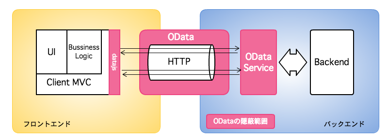

<a name="whatisodata">2. なぜODataが注目されるべきなのか？</a>
========

まず、なぜ今ODataが注目されるべきなのか、OpenUI5というUIフレームワークとODataが統合された時、何かメリットなのか少し背景など話しながら理解していきましょう。

### ODataとは何か？

<http://www.odata.org/> - Odata公式より。

> OData is a standardized protocol for creating and consuming data APIs. OData builds on core protocols like HTTP and commonly accepted methodologies like REST. The result is a uniform way to expose full-featured data APIs.  

> ODataとはデータAPIを作成し利用するために標準化されたプロトコルです。ODataはHTTPプロトコルと、一般的に浸透しているRESTという方法論で構成されています。つまり、これらのフル機能を満たすDataAPIを公開するために統一された方法です。

つまり、

「Webシステムにおける、フロントエンドとバックエンドとの面倒なAjax問い合わせの手続きを標準化したプロトコル」

プロトコルと言われてますが難しく捉える必要はありません。  
まったく新しい概念ではなく、既存のよくあるAjax上のやり取りを仕様化したものだと思っていただいて結構です。

旧来から、システムをいくつかのレイアー構造で分割し、レイアーをまたがる部分を抽象化、標準化する動きはよく見られました。  
代表的なものでは、アプリケーションからRDBMSへのデータアクセスの方法を標準化したODBCが存在します。  
「OData」は、フロントエンドからバックエンドへのデータアクセスを標準化した、いわばODBCのWeb版です。ODataはMicrosoft、IBM、SAP、Citrix社が中心となりデータアクセスプロトコルの業界標準となるよう動いています。 

ODataに関する情報はこちらが公式サイトはこちらです。  
<http://www.odata.org/>

### 昨今のWeb開発の流れ

昨今、Ajaxの登場によりWebアプリケーションにおいて、フロントエンドの重要性が増してきていることは周知の事実かと思います。  
それに伴ってフロントエンドの実装が高度化、複雑化してきたこともあり、ソリューションの1つとして様々なクライアントMVCフレームワーク（以下、クライアントMVC）が台頭してきました。

現在は、いくつかのクライアントMVCを中心とするフロントエンド開発のエコシステムができつつあり、今後の企業向けWebシステムにて普及・活用していくためには、もう一歩踏み込んだ、バックエンドのWebAPIとの間のベストプラクティスの蓄積と標準化、そして統合ソリューションが必要だと感じています。  

### データアクセス方法を標準化するODataの登場

ODataは、企業向けWebアプリケーションをターゲットに様々なデータアクセス方法を標準化しています。今後の企業向けWebアプリケーションの構築にて、様々なデータアクセスに対する柔軟に対応でき、現時点で非常に可能性を感じる仕様です。

では、実際に今までのクライアントMVCを利用した場合と比較して、ODataを利用した場合、どの辺りにメリットを感じるか話します。

まず、今までのクライアントMVCを利用した場合のアプリケーション構築イメージです。

ODataを使わない場合、フロントエンドを構築する一部にクライアントMVCが導入され、クライアントMVCを中心に統合されている状態でした。しかし、バックエンドとのWebAPIの設計、実装についてはそれぞれの案件ごとに対応している状況で、バックエンドも含めた形の統合とはほど遠い姿でした。

ではODataを利用した場合はどうでしょうか？

ODataを利用する場合、バックエンドがカスタムのWebAPIからOdataServiceと呼ばれるものに置き換わり、フロントエンドとバックエンドのデータアクセスについて標準化とライブラリによる隠蔽が可能です。  
（ちなみに、JavascriptにてODataを利用する場合、デファクトなJavascriptライブラリは[datajs](http://datajs.codeplex.com/)です。）  
しかし、ODataに対するURLパラメータの設定や、ODataから受け取ったデータのUIへのレンダリングは実装する必要があり、ODataのメリットより仕様の複雑さの方が目立つ状況でした。
このような状況のためか、ODataに対する世間の注目度はいまいちだったような気がします。

### UIフレームワークとODataの統合

そこで登場したものがODataをサポートするUIフレームの登場です。  
ここでのUIフレームワークとは、従来のクライアントMVCの機能を持ち、UIコンポーネントも持つものです。  
特徴としては、WebAPIから取得したデータを元に自動でUIを構築し、UI側の操作をダイレクトにバックエンドに連携できる機能を持っています。  
ODataをサポートする代表的なUIフレームワークとしてOpenUI5があります。

OpenUI5とODataを組み合わせた場合は次のようになります。

ODataとOpenUI5を組み合わせることで、バックエンドのデータアクセス部分からUIの変更まで隠蔽することが可能となりました。  
アプリケーション開発者は面倒なバックエンドとの同期について頭を悩ませる事なく、ビジネスロジックの構築に専念できます。

このようにバックエンドとフロントエンドを統合した形は、企業向けWebアプリケーション構築のソリューションとして可能性を感じます。  
OpenUI5というパートナーを得たことで、ODataの仕様は本当の意味で「使える」ものになりました。

**[[⬆]](#table)**