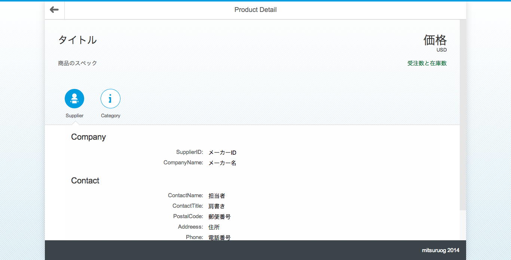

<a name="openui5withodata">5. OpenUI5とODataServiceの統合</a>
========

これからOpenUI5を使ったチュートリアルを行うに辺り、プロジェクトの環境面について説明します。

<a name="install">5.1. 導入・準備</a>
========

まず、チュートリアルを開始するには、以下のURLからチュートリアル用のGitリポジトリをCloneして、`bare`ブランチに移動してください。  
実際にチュートリアルを行う際は`grunt`コマンドを実行します。Gruntの初期設定を行っていない方は、[こちら](http://gruntjs.com/getting-started)を参照してください。

```git
git clone https://github.com/mitsuruog/Openui5-with-OdataService.git 
cd Openui5-with-OdataService
git checkout bare
npm install
grunt
```

`grunt`コマンドが正しく実行された場合は、<http://localhost:9000/>のページが自動表示されます。  

**[[⬆]](#table)**

<a name="project">5.2. プロジェクトの説明</a>
========

先ほど`git clone`したプロジェクトのフォルダ構成は以下の通りです。
```sh
.
├── ./Gruntfile.js
├── ./LICENSE
├── ./README.md
├── ./app # -> 実際のアプリケーションではここがWebアクセスRootです。
│   ├── ./app/Component.js
│   ├── ./app/img
│   ├── ./app/index.html # -> このファイルが最初に呼び出されます。
│   ├── ./app/style
│   │   └── ./app/style/style.css
│   └── ./app/view
│       └── # -> ここにCoffeeScriptをコンパイルしたファイルが格納されます。
├── ./bower.json
├── ./coffee # -> ここ以下がチュートリアルで編集するファイルです。
│   ├── ./coffee/Component.coffee
│   ├── ./coffee/util
│   └── ./coffee/view
│       ├── ./coffee/view/App.controller.coffee
│       ├── ./coffee/view/App.view.coffee
│       ├── ./coffee/view/CategoryInfoForm.fragment.coffee
│       ├── ./coffee/view/Detail.controller.coffee
│       ├── ./coffee/view/Detail.view.coffee
│       ├── ./coffee/view/Footer.fragment.coffee
│       ├── ./coffee/view/Master.controller.coffee
│       ├── ./coffee/view/Master.view.coffee
│       ├── ./coffee/view/NotFound.controller.coffee
│       ├── ./coffee/view/NotFound.view.coffee
│       ├── ./coffee/view/ProductInfo.fragment.coffee
│       ├── ./coffee/view/SearchList.fragment.coffee
│       ├── ./coffee/view/SupplierAddressForm.fragment.coffee
│       └── ./coffee/view/ViewSettings.fragment.coffee
├── ./docs
├── ./node_modules # -> gruntのタスクが格納されます。
└── ./package.json
```
### CoffeeScriptのコンパイル

本チュートリアルではJavascript部分はCoffeeScriptで記述してコンパイルによりJavascriptを生成する方式で行います。`grunt`コマンドを実行することで、`/coffee`配下のCoffeeScriptファイルの変更を監視して、変更時に自動でコンパイルするよう設定してあります。  
コンパイル後のJavascriptは`/app`に出力します。  
コンパイルがうまく行かない場合は、このフォルダのファイルを確認してください。

### リバースプロキシ

`localhost`で実行しているアプリケーションに対して、Northwindのドメイン`services.odata.org`のデータを利用することは、同一生成元ポリシー違反になるため、Gruntタスクにてリバースプロキシ設定を行っています。設定はこちらです。

*Gruntfile.js*
```js
connect: {
  options: {
  	// ...
  },
  proxies: [{
    context: '/V2',
    host: "services.odata.org",
    changeOrigin: true
  }],
  livereload: {
    // ...
  }
},
```
### 初期状態の確認

以下がチュートリアル開始時点のアプリケーションの状態です。  
アプリケーションのUI部分についてはMockレベルで完成している状態です。OpenUI5の公式ドキュメントなどを参照することで、ここまでは完成させることができると思います。  
経験上、ODataの扱いとODataを画面上にどのように組み込めば、Webアプリケーションとして完成するかが、最もつまづいたポイントです。以降のチュートリアルでは、ODataをOpenUI5にて用途ごとにどのように組み込めば良いかを中心に行います。

まず、<http://localhost:9000/>にアクセスすると商品情報検索画面が表示されます。中の実装はまだですので、検索結果は空です。


次に、<http://localhost:9000/#/product/1>にアクセスすると商品情報詳細画面が表示されます。当然、中の実装はまだですので、表示内容は空です。


**[[⬆]](#table)**