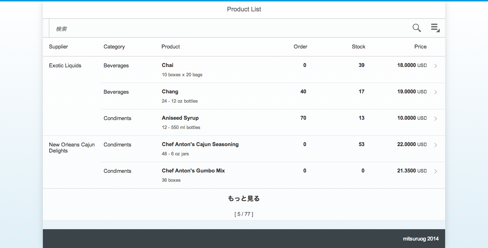
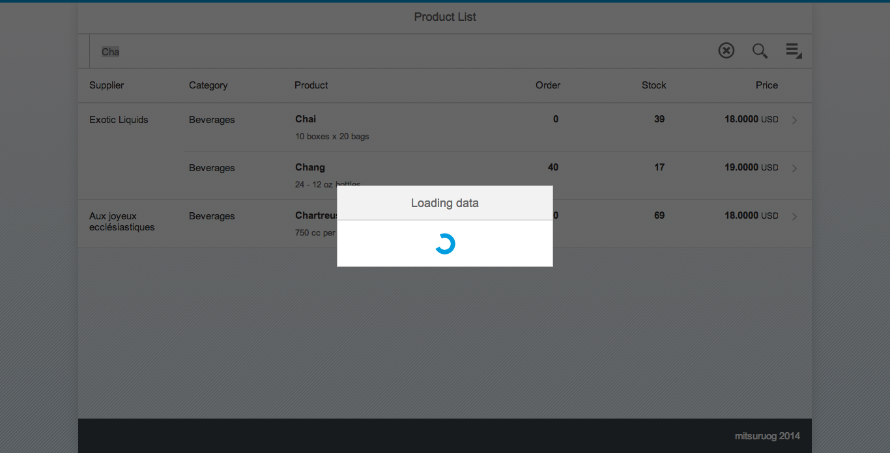
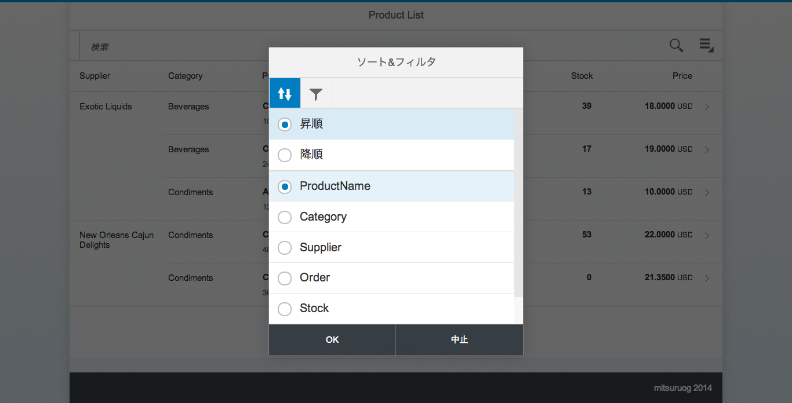

<a name="productlist_impl">5.3 商品リストの実装</a>
========

## ODataServiceのendpoint定義

まず、本アプリケーションにて利用するODataServiceのendpointを定義します。endpointの定義はアプリケーションで共用するため、`Componemt.coffee`の`init`内に記述します。

*Componemt.coffee:init()*
```coffeescript
init: ->
  
  ...

  # ここにOdataServiceのエンドポイントを設定します
  # /V2/Northwind/Northwind.svc/
  endpoint = sap.ui.model.odata.ODataModel "/V2/Northwind/Northwind.svc/", true
  @setModel endpoint
```

`sap.ui.model.odata.ODataModel`を作成し、名前なしのグローバルModelとしてアプリケーション内に保持します。

## <a name="productlist">5.3.a 商品リストの取得</a>
商品リストを取得してTable上に表示させてみましょう。`view/SearchList.fragment.coffee`を開いてください。`view/SearchList.fragment.coffee`は商品リストテーブルのUI部分を切り出したUI部品です。商品リストテーブルUI（以下、商品リストテーブル）に関連する変更はこちらに記述していきます。

まず、`view/SearchList.fragment.coffee`の`createContent`にて利用するODataServiceのEntitiesを指定します。このUIとODataを関連づける作業を**データバインド**と呼びます。

*view/SearchList.fragment.coffee:createContent()*
```coffeescript
	
	...

  createContent: (oController) ->
    new sap.m.Table
      id: oController.getView().createId("productList")
      growing: true
      growingThreshold: 5
      growingTriggerText: "もっと見る"
      noDataText: "データがありません。"
      headerToolbar: @_createHeaderToolbar(oController)
      columns: @_createHeaderColumns(oController)
      # ここにODataをバインドしていきます。
      items:
        path: "/Products"
        template: @_createTemplate(oController)

    ...

```
`items`プロパティにデータバインドを定義していきます。`path`には利用するEntitiesを、`template`には1行を生成するためのテンプレート定義を設定します。

結果は以下の通りです。


結果は48件表示されると思いますが、列の中身はすべて同じです。  
これはテンプレートの中身が固定値であるためです。次は、実際にテンプレートをODataの内容にあわせて表示させてみましょう。今度は`view/SearchList.fragment.coffee`の`_createTemplate`を変更します。

*view/SearchList.fragment.coffee:_createTemplate()*
```coffeescript
  _createTemplate: (oController) ->
    new sap.m.ColumnListItem
      type: "Navigation"
      press: [oController.onItemPress, oController]
      cells: [
        new sap.m.Text
          text: "{Supplier/CompanyName}"
        new sap.m.Text
          text: "{Category/CategoryName}"
        new sap.m.ObjectIdentifier
          title: "{ProductName}"
          text: "{QuantityPerUnit}"
        new sap.m.ObjectNumber
          number: "{UnitsOnOrder}"
        new sap.m.ObjectNumber
          number: "{UnitsInStock}"
        new sap.m.ObjectNumber
          number: "{UnitPrice}"
          unit: "USD"
      ]
```
テンプレート定義は`sap.m.ColumnListItem`を作成して返します。  
`cells`の中に各セルとなるUIコントロールが定義されている構造が読み取れると思います。各UIコントロールの中の`{`から`}`の中に含まれている文字列が**path**と呼ばれるもので、ODataのEntitiesからの相対的な位置を指定して各UIコントロールに対してピンポイントでデータバインドを定義しています。  
プロパティからさらに子のプロパティを参照する場合の区切り文字は`/`を指定します。

結果は以下の通りです。


`Product`の内容は表示することができましたが、`Supplier`と`Category`の内容が表示されません。これはODataのデータ取得の際に、返却されるデータにこれらの関連するEntityのデータが含まれていないためです。

返却されくるデータに関連するEntityのデータを含めるためには、`$expand`と`$select`を利用します。これらをOpenUI5で扱うためには、先ほどの取り上げた商品リストテーブルUIのデータバインドする際に、パラメータを渡すように設定します。  
`view/SearchList.fragment.coffee`の`createContent`のデータバインド部分を変更します。

*view/SearchList.fragment.coffee:createContent()*
```coffeescript
	
	...

  createContent: (oController) ->
    new sap.m.Table
      id: oController.getView().createId("productList")
      growing: true
      growingThreshold: 5
      growingTriggerText: "もっと見る"
      noDataText: "データがありません。"
      headerToolbar: @_createHeaderToolbar(oController)
      columns: @_createHeaderColumns(oController)
      # ここにODataをバインドしていきます。
      items:
        path: "/Products"
        template: @_createTemplate(oController)
        parameters:
          expand: "Category, Supplier"
          select: "*, Category/CategoryName, Supplier/CompanyName"

    ...

```
データバインドする際のプロパティに`parameters`を含める事で、ODataへデータアクセスする際にパラメータを渡すことができるようになります。

結果は以下の通りです。


これで一通りODataのEntitiesをテーブルにデータバインドして表示することができました。

**[[⬆]](#table)**

## <a name="search">5.3.b 商品名での検索</a>

では、次に商品名での検索機能を作っていきましょう。  
ODataSeviceのEntitiesに対して何らかのFilter処理を施す場合は、`$filter`を利用します。  
`view/Master.controller.coffee`の`onSearch`に検索処理を実装していきます。

*view/Master.controller.coffee:onSearch()*
```coffeescript
  
  ...

  onSearch: (evt) ->
    # ここに検索処理を書きます。

    # 画面からの入力値を受け取ってfilter定義を作成
    query = @query.getValue()
    filters = [new sap.ui.model.Filter("ProductName", "Contains", query)]
    
    # 商品リストテーブルUIのデータバインド定義を取得してfilter設定
    binding = @productList.getBinding "items"
    binding.filter filters, sap.ui.model.FilterType.Application

    ...

```
filterの演算子は`sap.ui.model.FilterOperator`に定義されているものを利用します。今回はあいまい検索の想定で`Contains`を指定しています。それ以外の設定値は以下の通りです。

```js
{
  BT: "BT"
  Contains: "Contains"
  EQ: "EQ"
  EndsWith: "EndsWith"
  GE: "GE"
  GT: "GT"
  LE: "LE"
  LT: "LT"
  NE: "NE"
  StartsWith: "StartsWith"
}
```

ちなみに、filter定義の`filters`はArrayであるため、複数のfilter定義を含めることが出来ます。

では、商品名の部分に`Cha`を入力して検索してみましょう。  
結果は以下の通りです。


このままでもいいのですが、検索時などのODataServiceへのデータアクセスの際にユーザーに対してフィードバックがありませんので、データアクセス時にローディングイメージを表示するようにしましょう。  
OpenUI5ではODataServiceはODataModelとして取り扱います。ODataModelにはODataServiceへのデータアクセスに関連するライフサイクルイベントが利用できますので、今回はライフサイクルイベントを利用してローディングイメージを表示させてみましょう。  
`Componemt.coffee`の`init`を変更しましょう。  

*Componemt.coffee:init()*
```coffeescript

  init: ->

    ...

    # ここにOdataServiceのエンドポイントを設定します
    # /V3/Northwind/Northwind.svc/
    endpoint = sap.ui.model.odata.ODataModel "/V3/Northwind/Northwind.svc/", true
    @setModel endpoint

    # バックエンドにデータ問い合わせの際のローディングイメージを表示します。
    busy = new sap.m.BusyDialog
      title: "Loading data"
    endpoint.attachRequestSent ->　busy.open()
    endpoint.attachRequestCompleted ->　busy.close()

    ...

```
`new sap.m.BusyDialog`でローディングイメージを表示するダイアログを生成します。上で作成したODataModeオブジェクトに対して`attachRequestSent`と`attachRequestCompleted`にてライフサイクルイベントが発生したタイミングで処理を割り込ませる事が可能です。  
`attachRequestSent`はODataServiceに対するデータアクセスが開始されたタイミングで発生します。
`attachRequestCompleted`はデータアクセスが完了したタイミングで発生します。成功、失敗は問いません。

先ほどと同じ商品名の部分に`Cha`を入力して検索してみましょう。  
結果は以下の通りです。


実際には、ローディング開始のタイミングが少し遅いと思いますので、ボタンを押したタイミングでローディングを表示させるなど、工夫が必要です。

ここまでで商品検索処理を実現することができました。

**[[⬆]](#table)**

## <a name="sortandfilter">5.3.c 商品リストのソート、フィルタ</a>

ではまずソート機能から作っていきましょう。  
テーブルの右上のこちらのアイコンを押すと、テーブルの表示設定を変更できるダイアログ（以下、ViewSettingsダイアログ）が表示されます。まだソート項目には固定値が表示されているため、実際のテーブルの項目を表示させるようにしましょう。  
`ViewSettings.fragment.coffee`の`createContent`を変更しましょう。

*ViewSettings.fragment.coffee:createContent()*
```coffeescript

  ...

  createContent: (oController) ->
    new sap.m.ViewSettingsDialog
      title: "ソート&フィルタ"
      confirm: [oController.onChangeViewSettings, oController]
      # ここにソート条件を書きます
      sortItems: [
        new sap.m.ViewSettingsItem
          text: "ProductName"
          key: "ProductName"
          selected: true
        new sap.m.ViewSettingsItem
          text: "Category"
          key: "Category/CategoryName"
        new sap.m.ViewSettingsItem
          text: "Supplier"
          key: "Supplier/CompanyName"
        new sap.m.ViewSettingsItem
          text: "Order"
          key: "UnitsOnOrder"
        new sap.m.ViewSettingsItem
          text: "Stock"
          key: "UnitsInStock"
        new sap.m.ViewSettingsItem
          text: "Price"
          key: "UnitPrice"
      ]
      filterItems: [

      ...

```
`sap.m.ViewSettingsDialog`の`sortItems`プロパティのArrayに`sap.m.ViewSettingsItem`を追加していきます。  
`sap.m.ViewSettingsItem`が実際のViewSettingsダイアログにソート項目として表示されるものです。`text`には表示ラベル、`key`はソートを選択した場合のキー項目に該当します。基本的に何を設定してもいいのですが、後の処理での使い易さを考慮して、通常はODataのpathを設定します。

結果は以下の通りです。


次に実際のソート処理を作成していきます。ソート処理は前め商品名検索と基本的には同じです。  
`Master.conrtoller.coffee`の`onChangeViewSettings`を変更しましょう。

*Master.conrtoller.coffee:onChangeViewSettings()*
```coffeescript

  ...

  onChangeViewSettings: (evt) ->
    # ここにソートとフィルタ処理を書きます。
    params = evt.getParameters()
    binding = @productList.getBinding "items"

    #ソート設定
    sortSettings = []
    if params.sortItem
      path = params.sortItem.getKey()
      descending = params.sortDescending
      sortSettings.push new sap.ui.model.Sorter(path, descending)

    binding.sort sortSettings

    ...

```
商品リストテーブルのデータバインド設定に対して`new sap.ui.model.Sorter`オブジェクトを設定します。

では、Stockの降順でソートしてみます。  
結果は以下の通りです。


Stockの大きい順に表示することができました。早速次はフィルタ機能を作っていきます。  
ソートと同様にViewSettingsダイアログの設定から行います。  

`ViewSettings.fragment.coffee`の`createContent`を変更しましょう。

*ViewSettings.fragment.coffee:createContent()*
```coffeescript

  ...

  createContent: (oController) ->
    new sap.m.ViewSettingsDialog
      title: "ソート&フィルタ"
      confirm: [oController.onChangeViewSettings, oController]
      # ここにソート条件を書きます
      sortItems: [
        
        ...

      ]
      # ここにフィルタ条件を書きます
      filterItems: [
        new sap.m.ViewSettingsFilterItem
          text: "Order"
          key: "UnitsOnOrder"
          multiSelect: false
          items: [
            new sap.m.ViewSettingsItem
              text: "less than 10"
              key: "UnitsOnOrder___LE___10___X"
            new sap.m.ViewSettingsItem
              text: "between 10 and 20"
              key: "UnitsOnOrder___BT___10___20"
            new sap.m.ViewSettingsItem
              text: "greater than 20"
              key: "UnitsOnOrder___GT___20___X"
          ]
        new sap.m.ViewSettingsFilterItem
          text: "Stock"
          key: "UnitsInStock"
          multiSelect: false
          items: [
            new sap.m.ViewSettingsItem
              text: "less than 10"
              key: "UnitsInStock___LE___10___X"
            new sap.m.ViewSettingsItem
              text: "between 10 and 20"
              key: "UnitsInStock___BT___10___20"
            new sap.m.ViewSettingsItem
              text: "greater than 20"
              key: "UnitsInStock___GT___20___X"
          ]
      ]

      ...

```
`sap.m.ViewSettingsDialog`の`filterItems`プロパティのArrayに`ssap.m.ViewSettingsFilterItem`を追加していきます。  
`text`と`key`はソート時と同じです、フィルタ条件がいくつかあるため`items`プロパティに`sap.m.ViewSettingsItem`を複数設定します。  
`sap.m.ViewSettingsItem`の`key`の値は`UnitsOnOrder___LE___10___X`のようになっていますが、後のフィルタ処理にて`___`を区切って分割して値を利用しています。  
ちょっと強引な実装ですね。

結果は以下の通りです。


`Master.conrtoller.coffee`の`onChangeViewSettings`を変更しましょう。

*Master.conrtoller.coffee:onChangeViewSettings()*
```coffeescript

  ...

  onChangeViewSettings: (evt) ->

    # ここにソートとフィルタ処理を書きます。
    params = evt.getParameters()
    binding = @productList.getBinding "items"

    #ソート設定
    sortSettings = []
    if params.sortItem
      path = params.sortItem.getKey()
      descending = params.sortDescending
      sortSettings.push new sap.ui.model.Sorter(path, descending)
    binding.sort sortSettings

    #フィルタ設定
    filterSettings = []
    jQuery.each params.filterItems, (i, item) ->
      settingArray = item.getKey().split "___"
      filter = new sap.ui.model.Filter settingArray[0], settingArray[1], settingArray[2], settingArray[3]
      filterSettings.push filter
    binding.filter filterSettings

    ...

```
いままで行ってきた商品名検索とソート処理とほとんど同じだとおもいます。

では、orderが10〜20の範囲でフィルタしてみます。    
結果は以下の通りです。


ここまででソートとフィルタ機能を作る事ができました。

**[[⬆]](#table)**