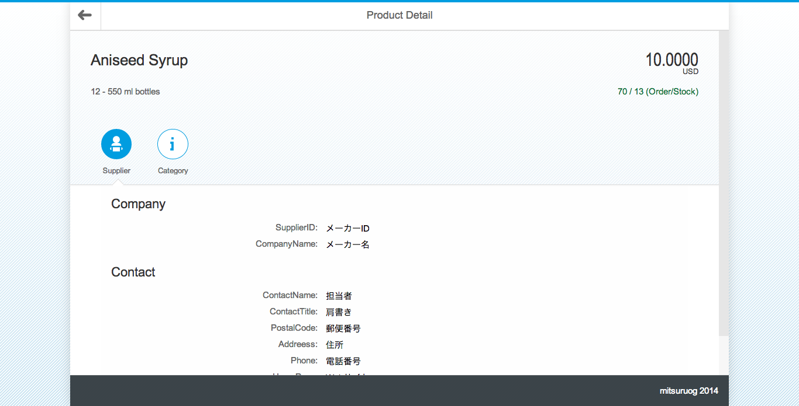
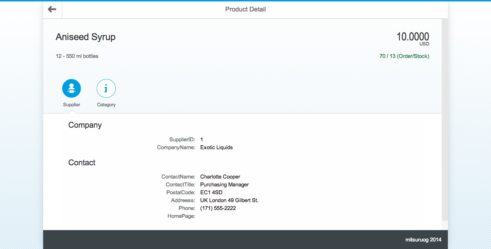

<a name="product_impl">5.4 商品詳細の実装</a>
========
次からは商品情報詳細画面の実装です。  
この画面では商品情報、カテゴリー情報、メーカー情報を参照することができます。  
画面上部に商品情報表示エリア、画面下部がカテゴリー情報とメーカー情報のタブとなっています。

## <a name="product">5.4.a 商品情報の参照</a>
まず、商品検索画面から`ProductID`を受け取って商品情報画面に表示します。`ProductID`は商品情報画面を表示する際のURLハッシュ末尾の数値が該当します。  
例）  
`http://localhost:9000/#/product/3`の`3`

OpenUI5ではroutingする際のパラメータとして渡されます。商品情報詳細画面へのroutingの処理は`Master.controlle.coffee`の`onItemPress`に書かれています。

*view/Master.controller.coffee:onItemPress()*
````coffeescript

  ...

  onItemPress: (evt) ->
    context = evt.getSource().getBindingContext()
    @router.navTo "Detail",
      id: context.getObject().ProductID

  ....

````
`@router.navTo`の第1引数に次の画面のrouter内でのエイリアス名、第2引数にURLハッシュにとなるパラメータ`ProductID`を渡しています。

では、この`ProductID`を商品情報詳細画面にて受け取って処理しましょう。`Detail.controlle.coffee`の`onRouteMatched`を変更します。  
（とは言っても、URLハッシュからProductIDを取得する部分は既に実装済みです。）

*view/Detail.controller.coffee:onItemPress()*
````coffeescript

  ...

  onRouteMatched: (evt) ->
    unless evt.getParameter("name") is "Detail"
      return

    # URLパラメータから商品IDを取得します。
    @productId = evt.getParameters().arguments.id

    # ここでEntityにアクセスします。
    @getView().bindElement "/Products(#{@productId})"

    ...

````
viewの`bindElement`にそのviewで参照したいODataModelのPathを設定します。今回のPriductsの場合、ProductIDがKeyとなるので実際は以下のようなPathを設定しています。  
例）  
`/Products(2)`  
ProductIDが2の場合

次に、商品情報表示エリアにODataのプロパティをデータバインドしていきます。`ProductInfo.fragment.coffee`の`createContent`を変更します。  
`title`、`number`、`attributes`の部分にはデータバインドしたいプロパティをそのまま設定します。  
`statuses`はデータバインドをする際に値を変更formatterを使用した、少し高度なデータバインドを行います。

*view/ProductInfo.fragment.coffee:createContent()*
```coffeescript

  ...

  createContent: (oController) ->
    new sap.m.ObjectHeader
      title: "{ProductName}"
      number: "{UnitPrice}"
      numberUnit: "USD"
      statuses: [
        new sap.m.ObjectStatus
          text: 
            parts: [
              {path: "UnitsInStock"}
              {path: "UnitsOnOrder"}
            ]
            formatter: (stock, order) ->
              "#{order} / #{stock} (Order/Stock)"
          state:
            path: "UnitsInStock"
            formatter: (stock) ->
              return if stock <= 10 then "Error" else "Success"
      ]
      attributes: [
        new sap.m.ObjectAttribute
          text: "{QuantityPerUnit}"

      ]

  ...

```
formatterを使ったデータバインドについて、少し解説します。  
まず、formatterを使ったデータバインドの基本形は、データバインドしたいプロパティに対して`path`と`fommatter`の2つを設定します。`path`にはデータバインドしたいOData側のプロパティ、`fommatter`は実際にデータがバインドされた際に実行されるcallbackで、バインドされた値が引数で与えられます。

この基本形を用いたものが`state`の部分です、`state`ではstock=10を閾値に返すステータスを変化させています。

次に、複数のODataのプロパティを利用して1つの出力とする例です。複数の複数のODataのプロパティを利用する場合は、`path`の部分に利用したいプロパティを`parts`の中に含めて定義します。バインドされた値は`fommatter`のcallbackの引数として与えられます。

`text`の部分は複数のプロパティを利用したもので、在庫数と受注数の2つを1つのフィールドに表示しています。

結果は以下の通りです。


商品検索画面に戻って、別の商品を選択して商品詳細画面に遷移すると商品情報が追従して表示されるはずです。

**[[⬆]](#table)**

## <a name="category">5.4.b カテゴリー情報とメーカー情報の参照</a>

ここから先は難しいパートはありません。ここまで理解した知識で作ることができます。
残るはタブの中にカテゴリー情報とメーカー情報を表示させたら完成です。

早速`Detail.controlle.coffee`の`onRouteMatched`を変更してタブに表示するデータをバインドしていきましょう。

*view/Detail.controller.coffee:onItemPress()*
```coffeescript

  ...

  onRouteMatched: (evt) ->

    ...

    # tabもデータをバインドします
    @tabs.getItems().forEach (item) ->
      item.bindElement item.getKey()

  ...


```
それぞれのタブは`@tabs.getItems()`にて取得できるため、forEachでそれぞれのタブに対して`bindElement`を使ってバインドしたいODataのPathを設定します。  
それぞれのタブのkeyにはEntityTypeの`NavigationProperty`（SupplierとCategory）が設定されています。既に商品情報画面のViewにはEntity`/Products(2)`がバインドされているため、Viewの子コントロールであるタブはそれ以下のPathを設定します。実際のデータバインドしているPathは次のようになっています。  
例）KeyがCategoryの場合  
`/Products(2)/Category`

次は、それぞれのタブのUIコンポーネントにODataのプロパティをバインドしていきましょう。`CategoryInfoForm.fragment.coffee`と`SupplierAddressForm.fragment.coffee`を変更します。

*view/CategoryInfoForm.fragment.coffee:createContent()*
```coffeescript

  ...

  createContent: (oController) ->
    form = new sap.ui.layout.form.SimpleForm
      minWidth: 1024,
      editable: false
      content: [
        new sap.ui.core.Title
          text: "Category"
        new sap.m.Label
          text: "CategoryID"
        new sap.m.Text
          text: "{CategoryID}"
        new sap.m.Label
          text: "CategoryName"
        new sap.m.Text
          text: "{CategoryName}"
        new sap.m.Label
          text: "Description"
        new sap.m.Text
          text: "{Description}"
      ]

    ...

```

*view/SupplierAddressForm.fragment.coffee:createContent()*
```coffeescript

  ...

  createContent: (oController) ->
    form = new sap.ui.layout.form.SimpleForm
      minWidth: 1024,
      editable: false
      content: [
        new sap.ui.core.Title
          text: "Company"
        new sap.m.Label
          text: "SupplierID"
        new sap.m.Text
          text: "{SupplierID}"
        new sap.m.Label
          text: "CompanyName"
        new sap.m.Text
          text: "{CompanyName}"
        new sap.ui.core.Title
          text: "Contact"
        new sap.m.Label
          text: "ContactName"
        new sap.m.Text
          text: "{ContactName}"
        new sap.m.Label
          text: "ContactTitle"
        new sap.m.Text
          text: "{ContactTitle}"
        new sap.m.Label
          text: "PostalCode"
        new sap.m.Text
          text: "{PostalCode}"
        new sap.m.Label
          text: "Addreess"
        new sap.m.Text
          text: 
            parts: [
              {path: "Country"}
              {path: "Region"}
              {path: "City"}
              {path: "Address"}
            ]
            formatter: (country = "", region = "", city = "", address = "") ->
              "#{country} #{region} #{city} #{address}"
        new sap.m.Label
          text: "Phone"
        new sap.m.Text
          text: "{Phone}"
        new sap.m.Label
          text: "HomePage"
        new sap.m.Text
          text: "{HomePage}"
      ]

      ...

```
結果は以下の通りです。  
カテゴリー情報

メーカー情報


これで商品検索画面と商品詳細画面が完成しました。

**[[⬆]](#table)**